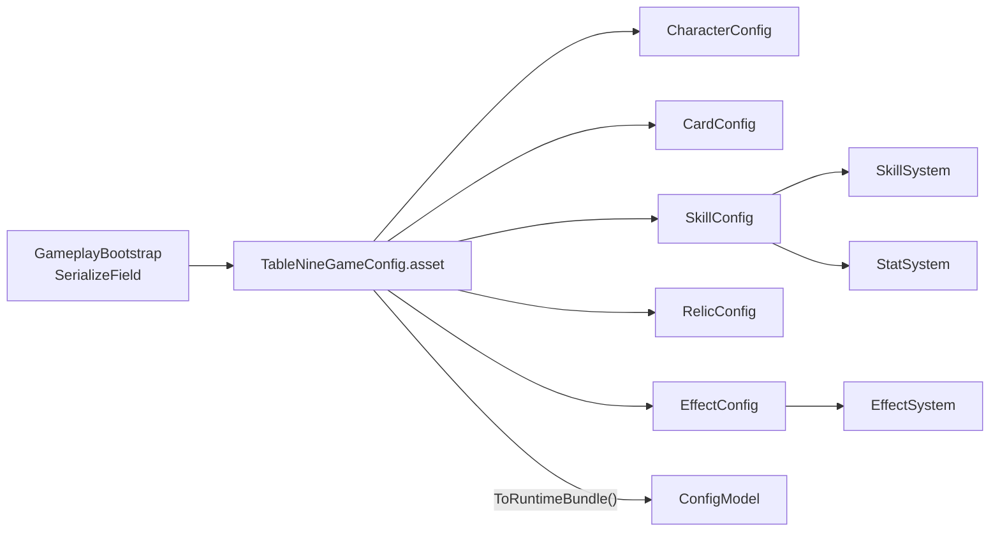

# Markdown
---
name: SO 配置全面迁移
overview: 将当前 `DefaultGameConfigFactory` + Registry 硬编码的全部静态数据与效果定义，迁移为 5 个分类 ScriptableObject 资产（落地 `Assets/ScriptableObjects`），由 Master 资产汇总；改造 ConfigModel/EffectSystem/SkillSystem/StatSystem 从 SO 加载，并提供 Editor 一键同步工具与测试接入。
todos:
  - id: define-so-types
    content: 新增 TableNineGameConfig + 5 子 Config SO 类型、GameConfigIds、可序列化 EffectAtom 参数结构、SkillBehaviorRule
    status: completed
  - id: editor-sync-tool
    content: 实现 Editor Sync/Validate 菜单，从 DefaultGameConfigFactory + Registry 导出首版资产到 Assets/ScriptableObjects/GameConfig/
    status: in_progress
  - id: runtime-injection
    content: TableNine.ConfigureGameConfig + ConfigModel 改造 + GameplayBootstrap SerializeField + MCP 场景接线
    status: completed
  - id: effect-skill-so-load
    content: EffectSystem/SkillSystem 改读 ConfigModel；合并 PassiveGraphs；去除 graphId 特判分支
    status: completed
  - id: skill-behavior-rules
    content: SkillBehaviorRule 执行器替换 StatSystem 中 OnMonsterSkill* 硬编码；StatSystem 仅做 EffectiveStats 聚合
    status: completed
  - id: tests-cleanup
    content: 测试 SetUp 注入 SO；ConfigValidator 去 Factory 依赖；Factory/Registry 移 Editor-only；跑 EditMode 测试
    status: pending
isProject: false
---

# TableNine 游戏配置 SO 化迁移计划

## 目标

- 静态数据（角色/卡牌/技能/遗物/房间/恶魔卡组规则）不再由运行时 C# 工厂生成，改为 **Inspector 可编辑 SO 资产**。
- 效果定义（帮助卡效果图、被动绑定、被动图）同样 SO 化；**StatSystem 中按 skillId 写死的怪物技能事件逻辑** 一并数据驱动化。
- 资产统一落地：`Assets/ScriptableObjects/GameConfig/`（Master 在 `Assets/ScriptableObjects/` 根目录）。
- **现行对照文档**：见 `Assets/Notes/SO配置与设计文档对照.md`（SO ↔ 设计案 ↔ 表现层，含 UI Prefab 现状）。

## SO 拆分方案（5 类 + 1 Master）

与现有 `[GameConfigDatabase](Assets/Scripts/Data/GameRuntimeData.cs)` 列表结构兼容，拆成 5 个子库 + 1 个汇总引用：

| 资产         | 路径                                                   | 内容                                                                        |
| ---------- | ---------------------------------------------------- | ------------------------------------------------------------------------- |
| **Master** | `Assets/ScriptableObjects/TableNineGameConfig.asset` | 引用下述 5 个子 SO；提供 `ToRuntimeBundle()`                                       |
| Characters | `.../TableNineCharacterConfig.asset`                 | `CharacterDefinition` 列表                                                  |
| Cards      | `.../TableNineCardConfig.asset`                      | `CardDefinition` 列表 + `MonsterDeckRuleDefinition` 列表（27 条规则一并烘焙）          |
| Skills     | `.../TableNineSkillConfig.asset`                     | `SkillDefinition` + `SkillEffectBinding` + **新增** `SkillBehaviorRule`（见下） |
| Relics     | `.../TableNineRelicConfig.asset`                     | `RelicDefinition` + `RoomDefinition`                                      |
| Effects    | `.../TableNineEffectConfig.asset`                    | `EffectGraphDefinition` 列表 + HelpCard `cardId→effectGraphId` 映射           |

**为何 5 类：** 角色、卡牌（含卡组规则）、技能（含绑定与行为）、遗物/房间、效果图——各为独立策划域，数量级符合 3–5 拆分要求。

## 代码改造要点

### 1. 新增 SO 类型（`[Assets/Scripts/Data/](Assets/Scripts/Data/)` 或新建 `Assets/Scripts/Config/ScriptableObjects/`）

- `TableNineGameConfig : ScriptableObject` — 聚合 5 子资产；`ToConfigSet()` 合并列表并调用现有后处理：
  - `[CardDefinitionMigration.MigrateHelpCardSemantics](Assets/Scripts/Config/CardDefinitionMigration.cs)`
  - 不再调用 `EffectGraphRegistry.AssignToConfig`（EffectGraphId 直接写入 Card SO）
  - `HelpCardSystemTag` 在同步时烘焙进 Card SO（移除 `[HelpCardSystemTagConfig.Apply](Assets/Scripts/Config/HelpCardSystemTagConfig.cs)` 运行时依赖）
- 5 个子 Config SO 类型，字段即现有 `[Serializable]` 定义（`CardDefinition`、`SkillDefinition` 等），避免重复建模。
- **新增 `SkillBehaviorRule`**（Serializable，存于 SkillConfig）用于替换 `[StatSystem](Assets/Scripts/System/RuntimeSystems.cs)` 中 `HasSkill(...)` 硬编码块，例如：
  - `SkillId`, `Trigger`（扩展 enum：`OnCardPlaced`）, `ConditionKey`, `BehaviorKind`（StatDelta / Aura / DirectDamage / HealBoardMonsters / …）, 参数字典（slot、amount、statType、targetScope）
  - 覆盖现有：黑桃/红桃/方块幼崽、破防专家、预先伏击、复仇、医疗兵、尖盾、爱之躯、防护光环、硬皮减伤等
- **保留 `GameConfigIds` 静态类**（从 `[DefaultGameConfigFactory](Assets/Scripts/Config/DefaultGameConfigFactory.cs)` 提取全部 `const string` ID）：System/测试/Command 中 80+ 处引用继续稳定，不再依赖 Factory 造数据。

### 2. 运行时注入（对齐 UI Registry 模式）

参考 `[GameplayBootstrap](Assets/Scripts/Game/GameplayBootstrap.cs)` 对 `TableNineUIPanelRegistry` 的做法：

- 新增 `TableNine.ConfigureGameConfig(TableNineGameConfig config)`（类似现有 `ConfigureRuntimePersistence()`）。
- `[ConfigModel.OnInit](Assets/Scripts/Model/RuntimeModels.cs)` 改为：
  1. 优先读 `TableNine.GameConfig.ToConfigSet()`
  2. EditMode 测试未注入时：`AssetDatabase.LoadAssetAtPath` 加载生产 Master 资产（Editor 专用 fallback）
  3. 仍无资产则 `Debug.LogError`（不再静默 fallback 到 Factory）
- `GameplayBootstrap` 增加 `[SerializeField] TableNineGameConfig mGameConfig`，在 `TableNine.InitArchitecture()` **之前**调用 `ConfigureGameConfig`。
- 场景引用通过 **Unity MCP** 写入 `TableNineBootstrap.unity`（遵守 rules.md 禁止手改 .unity）。

### 3. 效果图与技能绑定 SO 接入

| 现硬编码模块                                                                                 | 改造                                                                                                                                                   |
| -------------------------------------------------------------------------------------- | ---------------------------------------------------------------------------------------------------------------------------------------------------- |
| `[EffectGraphRegistry](Assets/Scripts/Effect/EffectGraphRegistry.cs)`                  | 改为 `IEffectConfigModel`（或在 ConfigModel 扩展 `TryGetEffectGraph`）；`EffectSystem.ResolveEffectGraph` 读 Model                                             |
| `[SkillEffectRegistry](Assets/Scripts/Skill/SkillEffectRegistry.cs)` + `PassiveGraphs` | 绑定与 passive 图迁入 `TableNineEffectConfig` + `TableNineSkillConfig.Bindings`；`SkillSystem.EnumerateBindings` 读 Model                                    |
| `SkillSystem` 中 `eg_relic_thorn_armor` / `eg_skill_thorn_skin_reflect` 特判              | 统一为 EffectGraph atom（新增 `ReflectDamageAtom` 或复用 Damage atom + scope 参数），删除 graphId 字符串分支                                                             |
| `StatSystem` 事件处理器（`OnMonsterSkill*`）                                                  | 改为通用 `SkillBehaviorExecutor`：读 `SkillBehaviorRule` 列表，按 Trigger+Condition 执行；StatSystem 仅保留 **EffectiveStats 聚合**（含从规则计算的 slot/aura 加值，不再写死 skillId） |
| `[ConfigValidator](Assets/Scripts/Config/ConfigValidation.cs)`                         | 校验 SO 合并结果；`GetEliteMonsterId/GetBossMonsterId` 改为从 CardConfig 查标记或配置表字段，移除对 Factory 的依赖                                                             |

### 4. Editor 同步工具（一次性/bootstrap）

新建 `[Assets/Scripts/Editor/TableNineGameConfigSyncEditor.cs](Assets/Scripts/Editor/)`：

- 菜单 `**TableNine/Game Config/Sync From Code Defaults`**
- 调用现有 `DefaultGameConfigFactory.Create()` **最后一次**作为种子，写入/更新 5 个子 SO + Master 资产到 `Assets/ScriptableObjects/GameConfig/`
- 同步内容包含：当前 `[EffectGraphRegistry](Assets/Scripts/Effect/EffectGraphRegistry.cs)` 全部 graph、`SkillEffectRegistry` 全部 binding、`HelpCardSystemTagConfig` 标签、`[AllLayersMonsterDeckRules](Assets/Scripts/Config/AllLayersMonsterDeckRules.cs)` 27 条规则
- 菜单 `**TableNine/Game Config/Validate`** — 运行 `ConfigValidator` 并弹窗报告
- Custom Inspector on Master：显示子资产引用、条目计数、Validate 按钮

同步完成后：

- `DefaultGameConfigFactory` / `DefaultGameConfigMonsters` / `DefaultGameConfigPlaytestContent` / `AllLayersMonsterDeckRules` **移入 Editor 程序集**（或标记 `Obsolete`，仅 Sync 工具使用），运行时程序集不再包含造数逻辑。

### 5. 测试改造

- 所有直接 `DefaultGameConfigFactory.Create()` 的测试（如 `[TableNineR1DataMigrationEditModeTests](Assets/Scripts/Tests/EditMode/TableNineR1DataMigrationEditModeTests.cs)`）改为：
  - 共享 helper `TableNineTestConfig.LoadProductionOrSync()` — Editor 下加载 Master SO；缺失时自动 Sync 一次
  - 或 `ScriptableObject.CreateInstance<TableNineGameConfig>()` + 最小种子（仅隔离测试需要时）
- `TableNine.InitArchitecture()` 前在 `[SetUp]` 注入 GameConfig
- 跑完全部 EditMode 测试确保行为不变

## 实施顺序

1. **类型与 Master 聚合** — 新建 SO 类型 + `ToConfigSet()` + `GameConfigIds`
2. **Editor Sync 工具** — 从现有 Factory/Registry 导出首版 6 个 `.asset`
3. **ConfigModel 注入链路** — `ConfigureGameConfig` + Bootstrap 接线（MCP）
4. **EffectSystem / SkillSystem 读 SO** — 删除静态 Registry 运行时构建
5. **SkillBehaviorRule + StatSystem 瘦身** — 迁移怪物技能 imperative 逻辑
6. **Validator / 测试 / 清理** — Factory 移 Editor；跑测试 + Unity Console

## 风险与边界

- **Dictionary 序列化**：`EffectAtomDefinition.Parameters` 当前是 `Dictionary<string,string>`，Unity 默认不序列化；需改为 `List<SerializableKeyValue>` 或在 Sync 时用 `[SerializeField] List<EffectGraphDefinition>` 直接赋值（Sync 工具在 Editor 内赋值可工作）。计划内统一改为 **可序列化 List 结构**，避免 Inspector 丢参数。
- **Wood 套装等 Relic 组合逻辑**：短期保留在 StatSystem/RelicSystem 代码中（组合判定复杂）；SO 只存单件遗物 stat bonus；后续可再加 `RelicSetBonusRule` SO。
- **设计案 Markdown**（`Assets/Docs`）仍不自动同步；SO 内容以 Sync 工具导出的当前 playable 子集为基准。

## 交付物

- `Assets/ScriptableObjects/TableNineGameConfig.asset` + `Assets/ScriptableObjects/GameConfig/*.asset`（5 个子库）
- 运行时从 SO 加载；Editor 可 Sync/Validate
- 效果图 + 技能绑定 + 怪物技能行为均数据驱动
- 现有 EditMode 测试全绿

