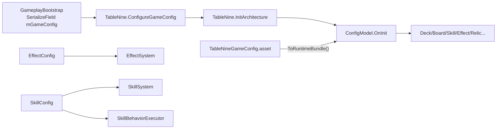

# SO 配置与设计文档对照（现行）

> 更新日期：2026-06-13  
> 用途：说明当前项目中 **ScriptableObject 配置资产**、**数据类**、**设计文档（`Assets/Docs`）** 三者的对应关系，以及表现层如何消费配置。  
> 相关迁移计划见 [[SO 配置全面迁移计划]]。

---

## 1. 总览

### 1.1 游戏数值配置（SO，现行主路径）

| 层级 | 资产路径 | C# 类型 |
|------|----------|---------|
| Master | `Assets/ScriptableObjects/TableNineGameConfig.asset` | `TableNineGameConfig` |
| 子库 | `Assets/ScriptableObjects/GameConfig/TableNineCharacterConfig.asset` | `TableNineCharacterConfig` |
| 子库 | `Assets/ScriptableObjects/GameConfig/TableNineCardConfig.asset` | `TableNineCardConfig` |
| 子库 | `Assets/ScriptableObjects/GameConfig/TableNineSkillConfig.asset` | `TableNineSkillConfig` |
| 子库 | `Assets/ScriptableObjects/GameConfig/TableNineRelicConfig.asset` | `TableNineRelicConfig` |
| 子库 | `Assets/ScriptableObjects/GameConfig/TableNineEffectConfig.asset` | `TableNineEffectConfig` |

类型定义：`Assets/Scripts/Config/TableNineGameConfigAssets.cs`  
稳定 ID 常量：`Assets/Scripts/Config/GameConfigIds.cs`

### 1.2 遗留类型（勿在新功能中使用）

| 类型 | 说明 |
|------|------|
| `GameConfigDatabase` | 旧版单体 SO（`GameRuntimeData.cs`），字段等价于 Master 合并前的 `GameConfigSet`，已被 5+1 拆分方案替代 |

---

## 2. 运行时加载链路

**注入优先级（`ConfigModel`）**

1. `TableNine.GameConfig`（Bootstrap 或测试 `ConfigureGameConfig` 注入）
2. Editor fallback：`AssetDatabase.LoadAssetAtPath` 加载 Master 资产
3. 仍无资产 → `Debug.LogError`（不再静默回退到运行时 Factory）

**Editor 维护菜单**

- `TableNine/Game Config/Sync From Code Defaults` — 从 `DefaultGameConfigFactory`（Editor-only）导出/刷新 6 个 `.asset`
- `TableNine/Game Config/Validate` — 对 Master `ToRuntimeBundle()` 结果跑 `ConfigValidator`

实现：`Assets/Scripts/Editor/TableNineGameConfigSyncEditor.cs`

---

## 3. 各 SO 承载的数据类

### 3.1 TableNineCharacterConfig

| 字段 | 类型 | 定义位置 |
|------|------|----------|
| Characters | `List<CharacterDefinition>` | `GameRuntimeData.cs` |

`CharacterDefinition` 主要字段：`CharacterId`, `DisplayName`, `BaseHp`, `BaseAttack`, `BaseDefense`, `InitialSkillIds`, `InitialHelpCardIds`

### 3.2 TableNineCardConfig

| 字段 | 类型 | 定义位置 |
|------|------|----------|
| Cards | `List<CardDefinition>` | `GameRuntimeData.cs` |
| MonsterDeckRules | `List<MonsterDeckRuleDefinition>` | `GameRuntimeData.cs` |

`CardDefinition` 主要字段：`CardId`, `DisplayName`, `CardType`, `Quality`, `MonsterLevel`, `Suit`, `Rank`, `Price`, `BaseHp/Attack/Defense`, `EffectGraphId`, `SystemTag`, `SkillIds`, `RestoreAfterNode` 等。

`MonsterDeckRuleDefinition`：`Layer`, `NodeInLayer`, `TotalCardCount`, `AllowedMonsterCardIds`, `LevelQuotas`, `MandatoryMonsterCardIds`

### 3.3 TableNineSkillConfig

| 字段 | 类型 | 定义位置 |
|------|------|----------|
| Skills | `List<SkillDefinition>` | `GameRuntimeData.cs` |
| SkillBindings | `List<SkillEffectBinding>` | `SkillRuntimeData.cs` |
| SkillBehaviorRules | `List<SkillBehaviorRule>` | `SkillBehaviorRule.cs` |

`SkillDefinition`：`SkillId`, `DisplayName`, `Description`, `GrantsFirstStrike`, `Trigger`, `EffectGraphId`, `MaxHpOnAcquire` 等。

`SkillEffectBinding`：被动/遗物/帮助卡等到效果图的触发绑定（`OwnerKind`, `OwnerDefinitionId`, `Trigger`, `EffectGraphId`）。

`SkillBehaviorRule`：怪物技能站位/移动/击杀等行为规则（替代原 `StatSystem` 内按 `skillId` 硬编码）。

### 3.4 TableNineRelicConfig

| 字段 | 类型 | 定义位置 |
|------|------|----------|
| Relics | `List<RelicDefinition>` | `GameRuntimeData.cs` |
| Rooms | `List<RoomDefinition>` | `GameRuntimeData.cs` |

`RelicDefinition`：`RelicId`, `DisplayName`, `Quality`, `Stat*Bonus`, `IsOneShot`, `ExcludeFromPool`, `TriggerDescription`

`RoomDefinition`：`RoomId`, `DisplayName`, `RoomType`, `RewardGold`, `StatMaxHpBonus`, `InjectCardId`

### 3.5 TableNineEffectConfig

| 字段 | 类型 | 定义位置 |
|------|------|----------|
| EffectGraphs | `List<EffectGraphDefinition>` | `EffectRuntimeData.cs` |
| HelpCardEffectMappings | `List<HelpCardEffectMapping>` | `TableNineGameConfigAssets.cs` |

`EffectGraphDefinition` + `EffectAtomDefinition`：效果原子图（`AtomType` + 可序列化 `EffectAtomParameter` 列表）。

`HelpCardEffectMapping`：帮助卡 `CardId` → `EffectGraphId`（Sync 时烘焙进 Card SO 的 `EffectGraphId`）。

效果原子类型常量：`EffectAtomTypes`（`EffectRuntimeData.cs`）。

### 3.6 Master 聚合

`TableNineGameConfig.ToRuntimeBundle()` 合并上述列表，并执行：

- `CardDefinitionMigration.MigrateHelpCardSemantics`
- HelpCard `EffectGraphId` 映射写入

输出：`GameConfigRuntimeBundle`（`Core: GameConfigSet` + 效果图 + 绑定 + 行为规则）。

---

## 4. 与设计文档（Assets/Docs）对照

> **重要**：设计案 Markdown **不会自动同步**到 SO。SO 内容以 Editor Sync 导出的 playable 子集为准；改数值/新增条目后应 Sync + Validate，并视需要回写设计文档。

| SO / 数据域 | 策划设计文档 | 数据表文档 |
|-------------|--------------|------------|
| **Character** | `05-职业与层级/职业.md` | — |
| **Card · 玩家/导师** | `02-卡牌/卡牌类型.md` | — |
| **Card · 怪物** | `01-机制规则/战斗机制.md`、`04-技能/怪物技能.md` | `07-数据/怪物卡数据.md` |
| **Card · 帮助** | `02-卡牌/帮助卡系统.md`、`02-卡牌/卡组管理.md` | `07-数据/帮助卡数据.md` |
| **MonsterDeckRule** | `01-机制规则/发牌机制.md`、`05-职业与层级/层级系统.md` | — |
| **Skill · 玩家** | `04-技能/技能系统.md`、`04-技能/玩家技能.md` | — |
| **Skill · 怪物** | `04-技能/怪物技能.md`、`04-技能/词条.md` | `07-数据/怪物卡数据.md`（技能列） |
| **SkillBehaviorRule** | 同上 + 站位/触发描述（机制文档） | — |
| **SkillEffectBinding** | `04-技能/技能系统.md`、遗物/帮助卡被动描述 | — |
| **Relic** | `03-遗物/遗物系统.md`、`03-遗物/遗物数值.md`、`03-遗物/套装.md` | `07-数据/遗物数据.md` |
| **Room** | `05-职业与层级/层级系统.md`、`05-职业与层级/商店.md` | — |
| **EffectGraph** | 帮助卡/技能/遗物效果散落在上述文档中 | `07-数据/帮助卡数据.md`（效果描述） |
| **机制常量** | `01-机制规则/属性.md`、`伤害公式.md`、`先攻.md`、`九宫格战场.md` | — |
| **UI 布局** | `06-UI/界面布局.md` | — |

### 4.1 CardType 与设计概念

| `CardType` | 设计文档概念 |
|------------|--------------|
| Player | 玩家卡 |
| Monster | 怪物卡 |
| Help | 帮助卡 |
| Room | 房间卡（流程用） |
| Tutor | 导师卡 |

### 4.2 HelpCardSystemTag 与设计「体系」

帮助卡数据表中的「体系」列 ↔ SO 中 `CardDefinition.SystemTag` ↔ 显示 `HelpCardSystemTagUtility.ToDisplayName`。

---

## 5. 表现层：SO 里**没有**美术槽位

配置 SO **不包含** `SpriteId`、`Icon`、`Prefab` 等表现字段。显示由运行时约定组装：

| 消费点 | 行为 |
|--------|------|
| `CardViewDataFactory` | `SpriteId = DefinitionId`；Tint 按卡牌类型/品质硬编码 |
| `IResourceUtility.LoadCardSprite` | 路径约定 `Resources/TableNine/Cards/{cardId}`，缺失则 placeholder |
| `GameplaySceneController` | 九宫格 1–9 + 道具槽世界物体 |
| `UIGameplayPanel` | 读 Model 刷新 HUD 文本；DescriptionPanel 单行 40 字上限 |
| 领域事件 | `PopupRequestedEvent`、`AttributeChoiceRequestedEvent` 等仍由 Command/System 发出；**尚无统一 UI 路由**，需后续接 Prefab `Show()`/`SetActive` |

设计文档中的 **装备栏 12 格**（`RewardConstants.MaxRelicSlots`）、**道具牌格 5 格** 等是 UI 布局约定，不在 Relic/Card SO 内配置。

---

## 6. 当前状态与待办

| 项 | 状态 |
|----|------|
| SO 类型 + Master 聚合 | ✅ 已完成 |
| Effect/Skill 读 ConfigModel | ✅ 已完成 |
| SkillBehaviorRule 执行器 | ✅ 已完成 |
| Editor Sync / Validate 菜单 | ✅ 已有；首版资产需保持与 Factory 同步 |
| Bootstrap 场景挂 Master SO | ⚠️ 场景中 `mGameConfig` 可能为空，需手动或通过 MCP 绑定 |
| EditMode 测试注入 SO | ⚠️ 进行中（`TableNineTestConfig`）；未注入时大量测试因缺 `character_imp` 失败 |
| `DefaultGameConfigFactory` | Editor-only，仅 Sync 工具使用 |
| Wood 套装等组合遗物逻辑 | 仍在代码（StatSystem/RelicSystem），SO 只存单件数值 |
| UI 事件 → 面板激活 | 🔲 待实现（Registry 已删，四 Prefab 已就绪） |

---

## 7. 文件索引（开发常用）

| 用途 | 路径 |
|------|------|
| SO 类型 | `Assets/Scripts/Config/TableNineGameConfigAssets.cs` |
| 卡牌/角色/遗物/房间定义 | `Assets/Scripts/Data/GameRuntimeData.cs` |
| 效果图 | `Assets/Scripts/Effect/EffectRuntimeData.cs` |
| 技能绑定 | `Assets/Scripts/Skill/SkillRuntimeData.cs` |
| 怪物技能行为规则 | `Assets/Scripts/Config/SkillBehaviorRule.cs` |
| 配置校验 | `Assets/Scripts/Config/ConfigValidation.cs` |
| 运行时 Model | `Assets/Scripts/Model/RuntimeModels.cs`（`ConfigModel`） |
| Bootstrap 注入 | `Assets/Scripts/Game/GameplayBootstrap.cs` |
| Sync 工具 | `Assets/Scripts/Editor/TableNineGameConfigSyncEditor.cs` |
| 测试 Helper | `Assets/Scripts/Tests/EditMode/TableNineTestConfig.cs` |
| HUD 文案 | `Assets/Scripts/UI/DescriptionPanelText*.cs` |
| UI Prefab | `Assets/Prefabs/UI/*.prefab` |
