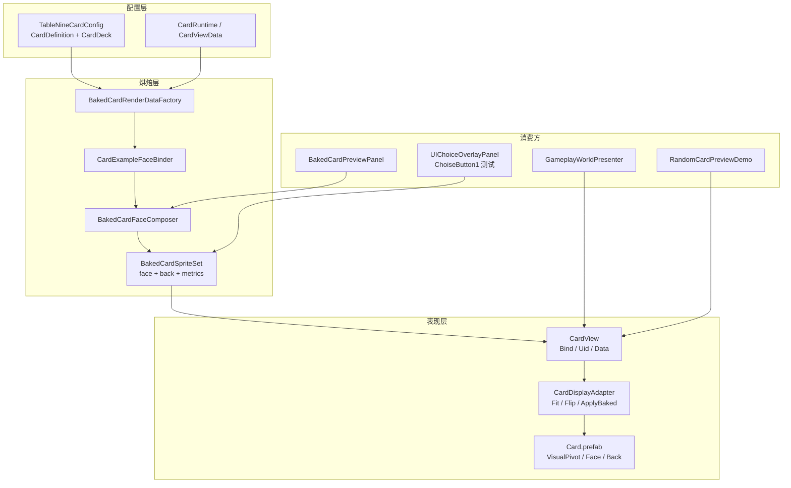

# 卡牌烘焙与显示系统

> **唯一入口文档**（聚合自 `动态卡牌配置系统.md`、`烘焙卡牌管线.md`、`卡牌烘焙正式落位落地汇报.md`，原文已归档至 `Assets/Notes/过程性汇报文档归档/`）  
> 最后更新：2026-06-14  
> 状态：世界空间正式链路已落位；UI Choice 业务接线部分完成

---

## 1. 系统目标

用 **SO 配置 → 烘焙输入 → 离屏合成单图 → 标准 Prefab 显示** 的统一链路，让棋盘/UI 共享同一套卡面产物，无需为每张卡单独维护美术 Prefab：

- 卡面/卡背：按牌组 `DeckId` 取 `DefaultFaceImage` / `DefaultBackImage`，单卡可覆写
- 主图标、血攻甲、技能角标：按 `CardType` 与运行态数值动态写入模板后烘焙
- 世界空间：实例化 `Assets/Prefabs/Cards/Card.prefab`，由 `CardDisplayAdapter` 负责缩放、重烘刷新、Y 轴翻面显隐
- 描述悬停：`CardPreviewDescriptionComposer` 组合多行文案（预览 Demo 用）

---

## 2. 架构总览



**分层原则（对照 ArchitectureDesign）：**

- 规则层不持有 Sprite/Prefab；烘焙与显示均在表现/工具边界
- 世界卡/UI 只消费 `CardViewData` / `CardDefinition` 映射出的 `BakedCardFaceRenderData`
- 状态变更经 `CardViewPresenter` → `BakedCardRenderDataFactory.CreateRuntime` 重烘，不绕过 Model/System

---

## 3. 核心代码地图

| 职责 | 路径 |
|------|------|
| 烘焙输入（配置/运行态 → RenderData） | `Assets/Scripts/Game/CardBaking/BakedCardRenderDataFactory.cs` |
| 离屏烘焙（正/背面、alpha 紧裁） | `Assets/Scripts/Game/CardBaking/BakedCardFaceComposer.cs` |
| 烘焙结果载体 | `Assets/Scripts/Game/CardBaking/BakedCardSpriteSet.cs` |
| 模板子节点绑定 | `Assets/Scripts/Game/CardPreview/CardExampleFaceBinder.cs` |
| 标准显示 Prefab 终端 | `Assets/Scripts/Game/CardDisplayAdapter.cs` |
| 卡牌数据绑定入口 | `Assets/Scripts/Game/CardView.cs` |
| 棋盘世界卡刷新 | `Assets/Scripts/Game/GameplaySceneController.cs`（`GameplayWorldPresenter`） |
| 空格预览 Demo | `Assets/Scripts/Game/CardPreview/RandomCardPreviewDemo.cs` |
| 悬停描述 | `Assets/Scripts/Game/CardPreview/CardPreviewDescriptionComposer.cs` |
| UI Choice 测试落点 | `Assets/Scripts/UI/UIChoiceOverlayPanel.cs` |
| 编辑器烘焙预览 | `Assets/Scripts/Editor/UI/BakedCardPreviewPanel.cs` |
| 翻面显隐规则（共享） | `Assets/Scripts/Game/CardBaking/BakedCardFaceVisibility.cs` |
| 运行时贴图释放 | `Assets/Scripts/Game/CardBaking/BakedCardRuntimeSpriteUtility.cs` |
| 贴图旋转实验（Demo 保留） | `Assets/Scripts/Game/CardBaking/BakedCardWorldView.cs`、`BakedCardFaceDemo.cs` |
| 卡面模板 | `Assets/Prefabs/Cards/CardExample.prefab`、`PlayerCard.prefab` |
| 标准承载 Prefab | `Assets/Prefabs/Cards/Card.prefab` |

---

## 4. 配置数据模型（SO）

### 4.1 牌组 `CardDeckDefinition`

| 字段 | 用途 |
|------|------|
| `DeckId` | 如 `deck_common`、`deck_tutor` |
| `DefaultFaceImage` | 牌组默认卡面 Sprite |
| `DefaultBackImage` | 牌组默认卡背 Sprite |

运行时解析（`ConfigModel`）：

- 卡面：`card.FaceImageOverride ?? deck.DefaultFaceImage`
- 卡背：`card.BackImageOverride ?? deck.DefaultBackImage`
- 主图标：`card.Image`

### 4.2 卡牌 `CardDefinition`

| `CardType` | 烘焙布局 |
|------------|----------|
| `Monster` | 名 + 主图标 + 血攻甲（运行态当前值）+ 技能角标 |
| `Help` | 名 + 主图标，隐藏血攻甲与技能角标 |
| `Tutor` | 同帮助卡；主图标优先 `Image`，否则 `SkillIds[0]` 技能图 |
| `Player` | 模板 `PlayerCard.prefab`，走 `BakedCardFaceTemplate.PlayerCard` |
| `Room` | 非本系统 |

### 4.3 导师卡约定

- 牌组：`deck_tutor`（`GameConfigIds.DeckTutorId`）
- CardId：`tutor_{skillId}`
- 生成：`DefaultGameConfigPlaytestContent.AddPlaytestTutorCards()`
- 悬停描述：仅关联技能的 `Description`

### 4.4 烘焙常量

```csharp
// BakedCardRenderDataFactory
StandardPixelsPerUnit = 100f
StandardBakeSize = Large          // 256×384 px
StandardSlotScale = 1.8185147f
TemplateLocalCardHeight = 2f
CanonicalWorldCardHeight ≈ 3.637  // 2 × 1.8185147
```

---

## 5. 模板 Prefab 节点约定（`CardExample`）

绑定器按 **子物体名称** 递归查找，改名会破坏绑定：

```
CardExample（根，BoxCollider2D 供悬停/尺寸参考）
├── CardFront          → SpriteRenderer，牌组卡面底图
│   ├── CardMainIcon   → 主图标
│   ├── CardAttackIcon / CardDefenseIcon / CardLifeIcon
│   └── EntryIcons     → 技能角标（Icon_0 / Icon_1 / …）
├── CardTextCanvas     → CardName / CardAttack / CardDefense / CardLife (TMP)
└── CardBack           → SpriteRenderer，牌组卡背
```

**不要**把 `GetEffectiveCardFaceImage` 设到 `CardMainIcon`；卡面与主图标是两层。

`CardExampleFaceBinder.Apply` 顺序：

1. `CardName` ← `DisplayName`
2. 血攻甲 TMP + 图标 ← 当前 Life/Attack/Defense（仅 `FullStats` 模式）
3. `CardFront` / `CardBack` ← 有效正反面 Sprite
4. `CardMainIcon` ← 主图标；导师无图时回落技能图
5. `EntryIcons` ← 怪物技能图标列表

---

## 6. 烘焙管线

### 6.1 流程

1. `BakedCardRenderDataFactory.CreateRuntime` / `CreateFromCardDefinition` 构造 `BakedCardFaceRenderData`
2. `BakedCardFaceComposer.ComposeSet` 离屏实例化 `CardExample` 或 `PlayerCard`
3. `CardExampleFaceBinder.Apply` 写入模板
4. 正/背面各渲染一次 → `ReadPixels` → **alpha 紧裁** → `Sprite.Create`（`FilterMode.Point`）
5. 输出 `BakedCardSpriteSet`（`FaceSprite`、`BackSprite`、`ContentWorldHeight`、`ContentFillRatio`）

### 6.2 尺寸修正要点

早期「卡面偏小」的根因：烘焙 RT 含透明边距，`FitToHeight` 按整张贴图 bounds 缩放。当前通过 **紧裁 + `CanonicalWorldCardHeight` 常量拟合** 修正。

### 6.3 API 速查

```csharp
// 推荐：一次拿到正背面与度量
var sprites = composer.ComposeSet(renderData, BakedCardRenderDataFactory.StandardPixelsPerUnit);

// 兼容旧调用
var face = composer.Compose(renderData, ppu, out var back);
```

---

## 7. 标准显示承载（`Card.prefab`）

### 7.1 预制层级

```
Card（BoxCollider2D + CardDisplayAdapter + CardView）
└── VisualPivot
    ├── Face（SpriteRenderer, z = -0.01）
    └── Back（SpriteRenderer, Y = 180°, z = +0.01）
```

### 7.2 `CardDisplayAdapter` 职责

| 能力 | 说明 |
|------|------|
| `ApplySprites(BakedCardSpriteSet, pending)` | 换正/背面、pending 色调、释放旧 runtime 贴图 |
| `FitToWorldHeight(target, contentFillRatio)` | 按父级 scale 补偿，拟合到标准世界高度 |
| `ApplyBaked(controller, data, composer, pending)` | 运行时重烘终端 |
| Y 轴翻面显隐 | `VisualPivot.localEulerAngles.y` 在 (90°, 270°) 显示背面；`SetFaceVisible(bool)` 可强制 |
| `LateUpdate` | 持续同步正反面 `enabled` 状态 |

**当前范围：** 仅显隐切换，不接棋盘旋转动画 / `BoardRotatedEvent`。

### 7.3 `CardView` 职责（瘦身后）

- 保留 `Bind` / `Show` / `Hide` / `BoundUid` / `Data`
- 烘焙显示委托 `CardDisplayAdapter`
- 灰盒文字 fallback 仍可用 `TextMesh`（无烘焙图时）

---

## 8. 运行时接入点

| 消费方 | 行为 |
|--------|------|
| `GameplayWorldPresenter` | 实例化 `Card.prefab` 于 `mBoardRoot`；事件驱动 `ComposeSet` + `Bind`；物品槽高度 × 0.85 |
| `RandomCardPreviewDemo` | `CardSlot1` 下实例化标准卡；空格随机切卡并重烘；怪物数值随机改写后重烘 |
| `NineGridCardMoveDemo` | 牌堆批量发外圈 + 跳格；悬停顶牌/外圈卡写 `DescriptionText`；外圈卡与中央 `PlayerCard` 同步放大 |
| `UIChoiceOverlayPanel` | `SetChoiceCardPreview` 仅 `ChoiseButton1` 测试接线；奖励/商店全量按钮 **未完成** |
| `BakedCardPreviewPanel` | 卡牌配置编辑器内实时烘焙预览 |

参考高度：优先 `CanonicalWorldCardHeight`；场景遗留 `CardExample` collider 仅作 fallback。

---

## 9. 描述组合（悬停预览）

`CardPreviewDescriptionComposer` → 场景 `DescriptionText`（`DescriptionPanel` 下 TMP）

| 类型 | 内容 |
|------|------|
| Monster | 卡牌描述 + 各技能描述（多行） |
| Help | 卡牌描述 + 效果摘要 |
| Tutor | 仅关联技能描述 |

格式化：`DescriptionPanelTextRules.FormatDisplayLines`（每行 `MaxLength = 25`）。

---

## 10. 编辑器工作流

| 菜单 | 作用 |
|------|------|
| `TableNine / Game Config / Sync From Code Defaults` | 代码默认 → SO（**保留已有 Sprite**） |
| `TableNine / Game Config / Fill Main Icons From Pixel Store` | 批量补主图标 |
| `TableNine / Game Config / Validate` | 配置校验 |
| 卡牌配置窗口 | 每张卡编辑块内「烘焙后预览」 |

### 新增卡牌清单

**普通怪物/帮助卡：**

1. 增加 `CardDefinition`（`DeckId`、`Image`、`Description`、数值、技能）
2. 缺图标时跑 Fill Icons 或手配
3. 在配置窗口确认烘焙预览

**导师卡：**

1. 增加 `SkillDefinition`
2. 将 `skillId` 加入 `TutorSkillPoolIds`
3. Sync From Code Defaults → 自动生成 `tutor_{skillId}`
4. 配置 `deck_tutor` 专属正反面

**更换牌组卡框：** 只改 `CardDecks` 对应 `DefaultFaceImage` / `DefaultBackImage`。

---

## 11. 场景 Demo 接线

- **组件挂载**：`NineGrid Main CardSlots/CardSlot1`（父物体，**不要**挂在 `CardExample` 上）
- **原因**：`GameplayWorldPresenter` 会隐藏场景 `CardExample`；Demo 在父节点实例化标准 `Card.prefab`
- **操作**：
  - **空格**：Monster + Help + Tutor 池随机切卡并重烘
  - **悬停**：多行描述
  - **ChoiseButton1**：同步显示烘焙正面（UI 测试）

### 快速验证

1. 打开 `Assets/Scenes/TableNineBootstrap.unity`
2. Play → 棋盘卡与 `CardSlot1` 预览卡应与槽位视觉齐平
3. 空格切怪 → 血攻甲变化、尺寸不回缩
4. 旋转 `VisualPivot` Y 轴 → 正反面显隐切换

---

## 12. 测试

```bash
TableNineCardBakingEditModeTests   # 烘焙输入、裁切、adapter 拟合、翻面规则
TableNineR8PresentationEditModeTests
```

关键用例：

- `DefinitionRenderData_Uses_Effective_Deck_Sprites_For_Monsters`
- `RuntimeRenderData_Uses_Current_Monster_Stats`
- `ComposeSet_Crops_Face_And_Back_And_Records_Content_Height`
- `CardDisplayAdapter_Fits_To_Canonical_World_Height`
- `BakedCardFaceVisibility_Switches_On_Pivot_Y_Rotation`

---

## 13. 已知问题与后续

| 项 | 状态 | 说明 |
|----|------|------|
| Choice 全按钮业务接线 | ⚠️ 未完成 | 仅 `ChoiseButton1` 测试；应复用 `BakedCardRenderDataFactory`，勿另拼图像逻辑 |
| UI 运行态截图验收 | ⚠️ | MCP `ScreenCapture` 对 Overlay Canvas 不稳定；用组件状态核查 |
| 运行时重烘缓存 | 建议 | 可按 `definitionId + 当前数值` 做表现层局部缓存，不进规则层 |
| 导师三选一数据源 | 待对齐 | `RewardSystem` 仍用技能 ID 池，未完全读 `CardType.Tutor` |
| `BakedCardFaceDemo` | 实验保留 | 与正式链路分离；勿与 `RandomCardPreviewDemo` 共用同一 `CardExample` 实例 |
| Sync 清空 Sprite | 已修复 | Sync 前 `Preserve*Visuals`；新条目 `Image` 仍可能为空 |

---

## 14. 变更记录

| 日期 | 内容 |
|------|------|
| 2026-06-14 | 初版：SO 动态绑定笔记、烘焙贴图实验、`CardExample` Demo |
| 2026-06-14 | 正式落位：统一烘焙管线、`Card.prefab` 承载、编辑器预览、棋盘/空格 Demo、`ChoiseButton1` 测试 |
| 2026-06-14 | 显示适配器：`CardDisplayAdapter`、alpha 紧裁、背面同步烘焙、翻面显隐、`CanonicalWorldCardHeight`；三份旧文档聚合为本文件 |
| 2026-06-15 | `NineGridCardMoveDemo` 接入悬停描述与外圈/`PlayerCard` 同步放大；详见 `NineGridCardMoveDemo九宫格外圈移动效果.md` |

---

## 15. 归档说明

以下文档已迁入 `Assets/Notes/过程性汇报文档归档/`，**请勿再直接维护**：

- `动态卡牌配置系统.md`
- `烘焙卡牌管线.md`
- `卡牌烘焙正式落位落地汇报.md`

后续变更请只更新 **本文件**。
