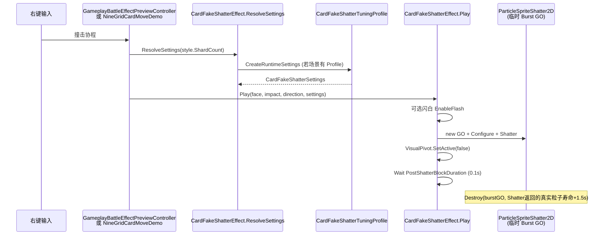

# 卡牌粒子碎裂效果 — 维护交棒笔记

> 记录时间：2026-06-15  
> 分支：`快速轻量开发初版demo`  
> 状态：**已改为默认 30s 物理碎片寿命，并代码兜底至少 10s 不因生命周期回收 — 待真实右键战斗回归观察**  
> 关联早期汇报：`Assets/Notes/CardBattleEffectPreview落地汇报.md`（其中「假碎裂」描述已过时，现为粒子 mesh 方案）

---

## 1. 背景与演进

### 1.1 原始需求

右键战斗预览：玩家卡撞击怪物卡 → 目标卡碎裂飞散 → 短阻塞后继续流程（移除卡牌、补牌等）。

### 1.2 技术路线变更

| 阶段 | 方案 | 结论 |
|------|------|------|
| v0 | `TableNine/CardFakeShatter` Shader + `CardFakeShatterEffect` 材质裂纹 | 观感差，像原地 shader 裂开 |
| v1 | 参考外部插件思路：**Built-in ParticleSystem + Mesh 粒子 + 原图 UV** | 方向正确，用户反馈「更好了」 |
| v1.x | 调方向/速度/隐藏卡面/阻塞 0.1s/随机碎裂/Inspector 调参 | 多数诉求已改善 |
| v2 | `Lifetime` 默认 **30s、不渐隐**，并代码兜底至少 10s 不被 ParticleSystem 生命周期回收 | 待真实右键战斗回归观察 |

旧 Shader 仍保留于 `Assets/Shaders/TableNineCardFakeShatter.shader`，**运行时已不再使用**。

---

## 2. 架构与调用链



### 2.1 参数管道（排查 Lifetime 必读）

```
CardFakeShatterTuning (Inspector / SO)
    ↓ ToRuntimeSettings()
CardFakeShatterSettings (运行时可变副本)
    ↓ 可选 ApplyGridFromShardCount(shardCount) 仅改 Rows/Columns
    ↓ 可选 ApplyRuntimeVariance() 不改 Lifetime
    ↓ Configure()
ParticleSpriteShatter2D 字段 mLifetime / mFadeStart
    ↓ ConfigureModules: main.startLifetime = max(Lifetime, 10.25)
    ↓ EmitShards: emitParams.startLifetime = max(Lifetime, 10.25)
```

**注意：** `GameplayBattleEffectPreviewController` 传入的 `style.ShardDuration` / `style.ImpactHold` **只影响协程等待与闪白时长**，**不应**直接截断粒子寿命。协程在 `PostShatterBlockDuration`（0.1s）后即返回，粒子应在后台继续飞。

---

## 3. 文件清单

| 路径 | 职责 |
|------|------|
| `Assets/Scripts/Game/ParticleSpriteShatter2D.cs` | 核心：不规则网格切 mesh、Emit、粒子模块配置 |
| `Assets/Scripts/Game/CardFakeShatterEffect.cs` | 静态入口：`Play` 协程、`ResolveSettings`、藏 `VisualPivot` |
| `Assets/Scripts/Game/CardFakeShatterSettings.cs` | 运行时参数包（无 Inspector，由 Tuning 生成） |
| `Assets/Scripts/Game/CardFakeShatterTuning.cs` | 可序列化调参 + 中文 Tooltip |
| `Assets/Scripts/Game/CardFakeShatterTuningProfile.cs` | 场景调参入口，`FindInScene()` |
| `Assets/Scripts/Game/CardFakeShatterTuningAsset.cs` | SO：`Create → TableNine → Card Fake Shatter Tuning` |
| `Assets/Scripts/Game/GameplayBattleEffectPreviewController.cs` | 正式场景右键战斗 FX |
| `Assets/Scripts/Game/CardPreview/NineGridCardMoveDemo.cs` | Demo 场景右键战斗 FX |
| `Assets/Scripts/Game/GameplaySceneController.cs` | 启动时 `AddComponent` Profile + BattleEffectPreview |
| `Assets/Shaders/TableNineCardFakeShatter.shader` | **遗留**，未删除 |

---

## 4. 当前默认参数（代码侧）

| 参数 | 默认值 | 说明 |
|------|--------|------|
| `Lifetime` | **30** | 默认物理寿命；代码层兜底至少 10.25s |
| `LifetimeRandom` | **0** | 无波动 |
| `FadeStart` | **1** | 不启用 colorOverLifetime 渐隐 |
| `PostShatterBlockDuration` | **0.1** | 碎裂后逻辑阻塞，不等待粒子播完 |
| `Force` / `Gravity` | 12 / 1.1 | 撞击方向飞溅 + 下落感 |
| `EnableRuntimeVariance` | true | 每次播放行列/方向等微随机，**不含 Lifetime** |

调参入口：场景中 `CardFakeShatterTuningProfile` → **Inline Tuning**（或指定 Tuning Asset）。

---

## 5. 已确认改善项（用户反馈）

- [x] 整体方向从 shader 假碎裂改为粒子碎片，观感方向对
- [x] 沿撞击方向飞溅（`HitDirectionBias`、世界空间方向）
- [x] 速度与重力感提升（关闭 `limitVelocityOverLifetime` 等）
- [x] 原卡图隐藏（`VisualPivot.SetActive(false)`，规避 `CardDisplayAdapter.LateUpdate` 重开 Face）
- [x] 碎裂随机感（抖动网格、跳过碎片、方向混沌等）
- [x] Inspector 暴露 `CardFakeShatterTuning` 全参数

---

## 6. 未解决问题（交棒重点）

### 6.1 现象

用户要求效果为：碎片像真实碎块一样被击碎飞开、下坠，至少 10s 内不因生命周期回收、不渐隐；若不可见，应是自然飞出/掉出屏幕，而不是被粒子系统或 Burst GO 硬删除。

### 6.2 已尝试修复（均未使用户确认解决）

1. 提高 `Lifetime` / 关闭 `LifetimeRandom` / `FadeStart=1`
2. `ConfigureModules` 显式设置 `main.startLifetime`、`main.duration≥12`、`stopAction=None`
3. 显式关闭 `colorOverLifetime`、`sizeOverLifetime`、`rotationOverLifetime` 等
4. 废弃 **共享 DontDestroyOnLoad 粒子单例**（此前每次 `Cleanup()` 会清空粒子、销毁 mesh）
5. 改为 **每次碎裂独立 `TableNine Card Shatter Burst` GameObject**，`Destroy(go, Lifetime+1.5f)`

### 6.3 本轮根因 / 修复记录（2026-06-15）

**根因 1：单个 `ParticleSystemRenderer.SetMeshes` 在当前 Unity 版本最多只接受 4 个 mesh。**  
旧实现按碎片数一次性传入 20+ 个 mesh，Unity 会报 `Too many meshes passed to SetMeshes, size will be clamped (20, max 4)`，后续 `emitParams.meshIndex > 3` 的碎片无法稳定按预期渲染，容易表现为「大量碎片很快没了 / 看不到」。

**根因 2：新建 `ParticleSystem` 后可能已处于 playing 状态。**  
旧实现先改 `main.duration` 再 Stop/Clear，触发 `Setting the duration while system is still playing is not supported`。

**修复：**

- `ParticleSpriteShatter2D` 改为按 **每 4 个 mesh 一个 ParticleSystemRenderer 批次** 拆分碎片；35 个碎片会生成 9 个批次，`meshIndex` 在各批次内保持 0–3。
- 每个批次在配置 `main.duration` 前强制 `Stop(...StopEmittingAndClear)`，再配置模块、Clear、Play、Emit。
- `Cleanup()` 销毁运行时 mesh/material 时区分 Play/Edit 模式，编辑态使用 `DestroyImmediate`，避免调试清理时报错。

**验证：**

- Unity MCP `refresh_unity(scope=scripts, compile=request)` 编译通过。
- `execute_code` 轻量触发测试确认 `SetMeshes` 分批后可正常发射 20+ 粒子，无 4 mesh 截断 warning。
- 最终清理临时对象后读取 Console：`error/warning = 0`。

### 6.4 本轮寿命语义修正（2026-06-15）

**新结论：** 仅把 `Lifetime` 设为 10s 仍不符合「真实碎片」目标，因为粒子会在 10s 到点被 ParticleSystem 回收；外层旧逻辑也会按 `settings.Lifetime + 1.5f` 销毁整个 Burst。现在改为：

- `CardFakeShatterSettings` / `CardFakeShatterTuning` / `ParticleSpriteShatter2D` 默认 `Lifetime=30s`。
- `ParticleSpriteShatter2D` 增加代码兜底：真实粒子寿命 `max(Lifetime, 10.25s)`，旧 Profile/Asset 即便残留 `Lifetime=2s` 也不会 10s 内回收。
- `CardFakeShatterEffect.Play` 使用 `shatter.Shatter()` 返回的真实粒子寿命来安排 `Destroy(burstObject, lifetime + 1.5s)`，避免外层按旧设置提前硬删。

**确定性验证：**

- 配置 `Lifetime=30`：模拟 `9.9s / 10.3s / 29.9s` 后粒子数均保持 `20`，`30.3s` 后为 `0`。
- 配置旧值 `Lifetime=2`：模拟 `9.9s` 后粒子数仍为 `20`，返回真实寿命 `10.25s`，`10.3s` 后回收。

### 6.5 后续 AI 建议排查方向（按优先级）

#### A. 运行时验证 Lifetime 是否真传到粒子

在 `EmitShards` 末尾临时加日志（或 Editor 断点）：

```csharp
Debug.Log($"[Shatter] mLifetime={mLifetime} emit={lifetime} main.startLifetime={mParticleSystem.main.startLifetime.constant}");
```

Play 模式下看 Console 是否为 10。若不是，追 `CardFakeShatterTuningProfile` 序列化旧值或 Tuning Asset 覆盖。

#### B. 粒子是否仍在渲染但被「看不见」

- 碎片飞出相机视锥 / 落出画面下方
- `sortingOrder` / `sortingLayer` 被其他 UI 或卡牌盖住
- 材质 `Sprites/Default` 与 Particle Mesh 模式兼容性

**验证：** Scene 视图跟随 Burst GO，暂停 `(Debug.Break)` 在消失时刻看 Hierarchy 是否仍有 `TableNine Card Shatter Burst`，ParticleSystem `Particle Count` 是否 > 0。

#### C. Mesh 粒子 + `SetMeshes` 生命周期

`ParticleSystemRenderer.SetMeshes` 使用运行时 `Mesh` 引用。当前 Burst GO 在 `Lifetime+1.5s` 才 Destroy；若提前消失，检查是否有 **其他系统 Destroy 该 GO** 或 **mesh 被 ReleaseOwnedMeshes 提前销毁**（同 GO 上不应有二次 Shatter）。

#### D. `EmitParams.startLifetime` 在 Unity 2022.3 Built-in 下是否生效

查 Unity 文档 / 实测：部分版本需同时设置 `main.startLifetime` **且** `emitParams.startLifetime`，或 `startLifetime3D` 等。可尝试改为 **SubEmitters 不用、仅用 main.startLifetime 常数 + 关闭 emission 批量 Emit** 的对照实验。

#### E. 场景中残留旧对象

Play 模式 Hierarchy 搜索：

- `TableNine Shared Particle Shatter`（旧单例，应不再创建；若存在可删）
- 多个 `TableNine Card Shatter Burst` 是否异常早消失

#### F. Profile 序列化值覆盖代码默认

`CardFakeShatterTuningProfile` 在 `GameplaySceneController` 上 **运行时 AddComponent** 时用代码默认值；但若场景曾保存过 Profile 或指定了 **Tuning Asset**，Inspector 里 `Lifetime` / `FadeStart` 可能仍是旧数（如 2.2 / 0.82）。

**操作：** Profile 右键 → `Copy Active Tuning From Scene Defaults`，或手动确认 `Lifetime=30`、`FadeStart=1`、`LifetimeRandom=0`。

#### G. 彻底绕过 ParticleSystem 做对照

临时用 **Rigidbody2D / 纯 SpriteRenderer 碎片** 或 **单 MeshRenderer 列表** 飞 10s，确认是粒子系统问题还是别处在杀视觉。

---

## 7. 已知架构坑点

1. **`CardDisplayAdapter.LateUpdate` → `BakedCardFaceVisibility.Apply`**  
   只 `faceRenderer.enabled=false` 会被刷回；必须 **`VisualPivot.SetActive(false)`**（已在 `HideCardVisual` 实现）。

2. **`shatterDuration` / `style.ShardDuration` 参数**  
   `Play(...)` 仍接收但 **不再用于等待粒子结束**；仅闪白可能被 `impactHold` 影响。勿误以为改 ShardDuration 能改粒子寿命。

3. **`ApplyRuntimeVariance`**  
   不修改 `Lifetime`；若以后要随机寿命需单独加字段。

4. **`ScaleGridFromBattleStyle`**  
   为 true 时，数字键 `2`–`6` 只根据 `ShardCount` 重算行列，**不覆盖** Tuning 里的 Force/Lifetime。

5. **旧汇报文档**  
   `CardBattleEffectPreview落地汇报.md` 仍写「假碎裂/Shader」，维护时以本文为准。

---

## 8. 测试步骤（复现 / 回归）

1. 打开唯一场景 `Assets/Scenes/TableNineBootstrap.unity`，Play。
2. 确认 `GameplaySceneController` 物体上有 `CardFakeShatterTuningProfile`（无则运行时会 Add）。
3. Inspector：`Lifetime=30`，`FadeStart=1`，`LifetimeRandom=0`，`PostShatterBlockDuration=0.1`。
4. 右键棋盘怪物卡触发撞击碎裂。
5. 观察碎片可见时长；可选数字键 `2`–`6` 切换风格（仅影响网格密度等，若 `ScaleGridFromBattleStyle=true`）。
6. Unity Console 无编译错误；MCP `read_console` types=error。

**Demo 路径：** `NineGridCardMoveDemo` 同样调用 `CardFakeShatterEffect.ResolveSettings(style.ShardCount)`。

---

## 9. 推荐后续工作项

| 优先级 | 任务 |
|--------|------|
| P0 | 用 Play 模式实测 + 日志确认 `emitParams.startLifetime` 与粒子剩余数，定位「短消失」根因 |
| P1 | Lifetime 问题解决后，更新 `CardBattleEffectPreview落地汇报.md` 或标注 superseded |
| P2 | 删除或归档 `TableNineCardFakeShatter.shader`（确认无引用后） |
| P3 | 考虑 Editor 下 `CardFakeShatterTuningProfile` 的 `OnValidate` 强制同步默认 Lifetime，避免序列化陈旧值 |
| P4 | 正式战斗结算接入时，将 `CardFakeShatterEffect.Play` 挂到领域事件 / Presentation 序列，而非仅 Preview 控制器 |

---

## 10. 参考

- 用户提供的方案笔记（桌面 `碎裂效果.md`）：Mesh 粒子 + 原图 UV + ParticleSystem，与当前实现一致。
- Unity 2022.3 Built-in ParticleSystem：`ParticleSystemRenderer.SetMeshes`、`ParticleSystem.Emit(EmitParams)`。
- 项目规则：`AGENTS.md` — 表现层改动优先走现有 Presenter / 事件，勿在领域层硬写。

---

## 11. 变更历史（简）

| 日期 | 摘要 |
|------|------|
| 2026-06-15 | Shader 假碎裂 → `ParticleSpriteShatter2D` 首版 |
| 2026-06-15 | 撞击方向、速度、藏卡面、阻塞 0.1s |
| 2026-06-15 | 随机碎裂 + `CardFakeShatterTuning` Inspector |
| 2026-06-15 | Lifetime 改 10s / 不渐隐；共享单例改独立 Burst GO — **用户反馈仍未解决** |
| 2026-06-15 | 本文档交棒 |

---

**交棒给后续 AI：** 若真实右键战斗回归仍异常，请先按 §6.5 做 **Play 模式实证**（粒子 Count + Lifetime 日志），不要先大改参数。
