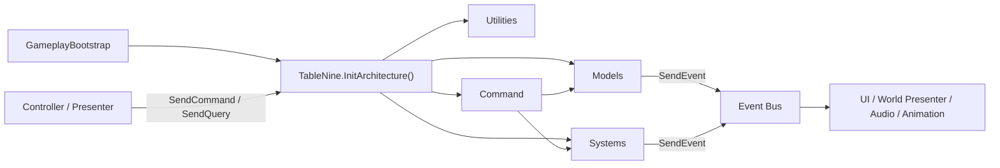

# 当前游戏实现深度拆解（架构、流程、阻塞与接入点）

> 更新日期：2026-06-13  
> 用途：给后续要继续推进表现层、UI、音效、动效、临时策划改动的人看。  
> 这份文档的目标不是“程序员式完整 API 手册”，而是把 **当前代码到底怎么运作** 讲清楚，让你后续能更准确地指导 AI 去改。  
> 本文基于当前代码现状，不等于设计案理想形态。

---

## 0. 先给你结论

如果你只想先抓住最重要的判断，可以先记住这 8 句话：

1. 这个项目里，**真正有权改游戏状态的核心入口是 `Command`，不是 MonoBehaviour，也不是 UI。**
2. 表现层大多只是“看事件然后刷新/播表现”，**逻辑权威层在 `Assets/Scripts/Command`。**
3. 运行时每张牌真正的数据本体都在 `CollectionModel` 里；棋盘、手牌格、牌库大多只是在保存 `Uid` 和位置状态。
4. 这个项目当前很明显是 **先算完逻辑，再播表现** 的路子，不是“一边演一边算”。
5. 现在的“阻塞”主要不是靠协程乱等，而是靠四套机制：  
   `FlowPhase`、`InputLockReason`、`PendingHelpCardAction`、`PresentationSequence`。
6. 你以后如果只是加一个被动式动效/音效，通常不该去改战斗主逻辑，而是应该挂在事件监听层。
7. 你以后如果要做“会卡住玩家操作 0.5 秒”的演出，优先应该接在 `PlayPresentationSequenceCommand` / `ISequenceUtility` 这条线上，而不是在 View 里直接硬 `WaitForSeconds`。
8. 当前代码已经有“可阻塞演出”的骨架，但默认注册的是 `ImmediateSequenceUtility`，所以 **逻辑上有阻塞点，时间上默认其实不等待**。

---

## 1. 建议你先记住的 4 个状态器

以后你看到“为什么现在不能点”“为什么这次点击不是普通点击”“为什么 AI 在这里不该直接写个 delay”，优先看下面这 4 个东西。

### 1.1 `FlowModel.Phase`

文件：`Assets/Scripts/Model/RuntimeModels.cs:736-819`  
枚举：`Assets/Scripts/Data/GameRuntimeData.cs:53-75`

它回答的问题是：

- 游戏当前语义阶段是什么？
- 现在是在玩家可控、战斗中、补牌中、选奖励中，还是房间结算中？

当前主流程里最关键的 Phase 有：

| Phase | 含义 |
|------|------|
| `PlayerControl` | 玩家正常操作阶段 |
| `CombatResolving` | 战斗结算中 |
| `BoardMoving` | 棋盘旋转中 |
| `BoardRefilling` | 补牌中 |
| `ClearReady` | 本节点怪物清空，等待发奖励/选房间 |
| `HelpRewardChoosing` | 三选一帮助卡 |
| `RoomChoosing` | 选下个房间 |
| `RoomResolving` | 房间效果正在结算 |
| `ChestRewardChoosing` / `TutorSkillChoosing` / `Shop` | 各种覆盖层/房间内交互 |
| `GameOver` / `Victory` | 局结束 |

### 1.2 `FlowModel.ActiveLocks`

文件：`Assets/Scripts/Model/RuntimeModels.cs:775-818`  
枚举：`Assets/Scripts/Data/GameRuntimeData.cs:77-87`

它回答的问题是：

- 当前为什么不能继续点？
- 禁止输入到底是哪一类锁在生效？

常见锁：

| Lock | 含义 |
|------|------|
| `CombatResolving` | 战斗结算中的输入锁 |
| `BoardMoving` | 棋盘旋转中的输入锁 |
| `BoardRefillRunning` | 补牌中的输入锁 |
| `SequenceRunning` | 演出序列中的输入锁 |
| `DialogueRunning` | 文本/对白中的输入锁 |
| `OverlayVisible` | 覆盖层打开时的输入锁 |

### 1.3 `DeckModel.PendingHelpCardAction`

文件：`Assets/Scripts/Data/GameRuntimeData.cs:511-533`  
状态落点：`Assets/Scripts/Model/RuntimeModels.cs:217-326`

它回答的问题是：

- 下一次点击棋盘，到底是普通交互，还是“正在选飞刀目标”？
- 现在是不是在一个帮助卡的半中间状态？

它和 InputLock 不是一回事。

- `InputLock` 是“完全不让你继续做普通操作”。
- `PendingHelpCardAction` 是“你还能点，但这次点击会被解释成另一种语义”。

这点很关键。很多“选目标型帮助卡”并不是真的全局阻塞，而是把下一次点击改造成目标选择。

### 1.4 `PresentationSequence`

事件：`Assets/Scripts/Event/RuntimeEvents.cs:206-239`  
命令：`Assets/Scripts/Command/RuntimeCommands.cs:802-931`  
工具：`Assets/Scripts/Utility/InfrastructureUtilities.cs:351-361`

它回答的问题是：

- 某段逻辑结算完之后，要不要插入一个“演出段”再继续？
- 这个演出结束之后，应该回到哪条后续命令链？

当前有三种序列类型：

| SequenceType | 作用 |
|------|------|
| `CombatResolution` | 战斗表现段 |
| `BoardRotation` | 棋盘旋转表现段 |
| `BoardRefill` | 补牌表现段 |

---

## 2. 这个项目的真实架构，不要把它想复杂

最简单的人话版：

1. `GameplayBootstrap` 负责把架构启动起来。  
2. `TableNine` 把所有 Utility / Model / System 注册进去。  
3. Controller / Presenter 接收点击，发 `Command` 或 `Query`。  
4. `Command` 改状态，`System` 算规则，`Model` 存状态。  
5. 状态变化后发 `Event`。  
6. 各种 UI / 视图 / 音效 / 动画 Presenter 监听这些事件，做表现刷新。

可以把它粗略理解成下面这张图：

### 2.1 真正的总入口：`TableNine`

文件：`Assets/Scripts/TableNine.cs:53-90`

这里注册了整个运行时的核心拼图：

- Utility：随机、存档、资源、音频、文本动画、演出序列、命令追踪、命令回放、调试日志
- Model：`RunModel`、`PlayerModel`、`BoardModel`、`DeckModel`、`CollectionModel`、`ConfigModel`、`FlowModel`、`RewardModel`
- System：`BoardSystem`、`DeckSystem`、`CombatSystem`、`StatSystem`、`EffectSystem`、`SkillSystem`、`InputLockSystem`、`RewardSystem`、`RelicSystem`、`ShopSystem` 等

### 2.2 真正的状态改动总线：`Command`

文件：`Assets/Scripts/TableNine.cs:92-151`

这个地方非常重要，因为它决定了“项目到底怎么串起来”：

- 每次执行 `Command`，`TableNine` 都会经过统一入口。
- 根命令开始时，会调用 `SkillSystem.BeginRootCommand()`。
- 同时会写入命令追踪和命令回放。

这意味着：

1. 项目把“状态改动”看得很严肃，不是脚本哪都能随便改。
2. 技能触发递归保护，是围绕“根命令”做的。
3. 后续你要查一段逻辑为什么发生，`Command` 链比看 UI 更重要。

### 2.3 当前是典型的“先算后演”

这个项目当前最重要的实现风格，是：

- **先把逻辑算完**
- **再发演出序列事件**
- **表现层自己根据已经结算好的结果去播**

最典型的几个证据：

- 战斗：`StartCombatCommand` 先 `ResolveCombatCommand`，后 `PlayPresentationSequenceCommand`  
  见 `Assets/Scripts/Command/RuntimeCommands.cs:357-387`
- 旋转：`CommitPlayerActionCommand` 先 `RotateClockwise`，后 `PlayPresentationSequenceCommand`  
  见 `Assets/Scripts/Command/RuntimeCommands.cs:934-954`
- 补牌：`RefillBoardCommand` 先真实 `PlaceCard`，后 `PlayPresentationSequenceCommand`  
  见 `Assets/Scripts/Command/RuntimeCommands.cs:319-354`

这件事的后果非常重要：

1. 视觉层适合做“跟随结果的演出”。
2. 想做“中间暂停 0.5 秒再继续播下一个结果”，当前骨架可以做到。
3. 但如果你想做的是“逻辑本身在第一段和第二段之间停下来，再看情况决定后续逻辑”，当前结构就不算天然支持，需要把命令拆段。

后面第 8 节会专门讲这个。

---

## 3. 关键 Model 到底各管什么

这一节你最好反复看。因为很多时候你指导 AI 改动，核心不是“改哪个类”，而是“这件事本来应该落在哪个 Model 里”。

### 3.1 `RunModel`

文件：`Assets/Scripts/Model/RuntimeModels.cs:5-48`

职责：

- 当前层数
- 当前节点
- 当前随机种子
- 当前局是否激活
- 当前角色 ID

它更像“这局游戏在地图流程上的大状态”。

### 3.2 `PlayerModel`

文件：`Assets/Scripts/Model/RuntimeModels.cs:50-139`

职责：

- 玩家牌的 `Uid`
- 金币
- 角色基础攻防血
- 玩家技能列表
- 玩家遗物列表

注意：

- 这里保存的是“玩家拥有的长期属性与附属物”。
- 但玩家卡当前血量、护甲、基础攻击这些运行中数值，本体还是在 `CollectionModel` 的玩家 `CardRuntime` 上。

### 3.3 `BoardModel`

文件：`Assets/Scripts/Model/RuntimeModels.cs:141-193`

职责：

- 9 个格位上分别放着哪个 `CardUid`
- 玩家当前在几号格

非常关键的一点：

- `BoardModel` 不保存“怪物有多少血”“帮助卡是什么效果”。
- 它只保存“这个格子里放的是哪张运行时卡”。

### 3.4 `DeckModel`

文件：`Assets/Scripts/Model/RuntimeModels.cs:195-326`

职责很多，实际是“牌组区 + 道具牌格 + 帮助卡运行态”的总管：

- 玩家拥有的帮助卡 `OwnedHelpCards`
- 每张帮助卡的状态 `HelpCardStates`
- 恶魔队列 `DemonDeckQueue`
- 战斗抽牌堆 `BattleDrawPile`
- 道具牌格 `ItemSlots`
- 节点开始时的帮助卡快照 `NodeStartSnapshot`
- 当前是否在等待帮助卡二段操作 `PendingHelpCardAction`
- 下一张战斗牌预览 `NextBattleCardPreview`
- 补牌防抖状态 `RefillRunning` / `RefillPending`
- 精英怪击杀后待触发的导师技能选择 `PendingTutorSkillChoice`

你以后如果碰到：

- 帮助卡拾取后去哪了？
- 道具栏怎么知道某张卡还在不在？
- 选目标状态怎么记住？
- 补牌为什么不会同时触发两次？

基本都要回来看这个 Model。

### 3.5 `CollectionModel`

文件：`Assets/Scripts/Model/RuntimeModels.cs:328-440`

这是整个运行时卡牌实例的“实体仓库”。

里面存的是 `CardRuntime`，也就是每张牌当前真正的活体数据：

- `Uid`
- `DefinitionId`
- `CardType`
- `CurrentHp`
- `MaxHp`
- `CurrentArmor`
- `BaseAttack`
- `BaseDefense`
- `SkillIds`
- `BoardSlot`
- `ItemSlotIndex`

这点非常关键：

> **运行时卡牌数据的唯一真身在 `CollectionModel`。**

也就是说：

- 棋盘上那张怪的血量不在 `BoardModel`
- 道具格那张帮助卡不在 `ItemSlots` 本体里
- 牌堆里那张牌的数值也不在 `BattleDrawPile` 里

这些地方基本都只是在引用 `Uid`。  
真正查“这张牌当前是多少血、在哪个格子、是什么类型”，都要回 `CollectionModel`。

### 3.6 `ConfigModel`

文件：`Assets/Scripts/Model/RuntimeModels.cs:442-734`

职责：

- 从 `TableNineGameConfig` 加载所有 SO 配置
- 建立卡牌、角色、技能、遗物、房间、效果图、技能绑定、技能行为规则的运行时索引

也就是说：

- 设计案数据 / SO 进运行时后的统一读口是它
- `EffectSystem`、`SkillSystem`、`RewardSystem` 基本都靠它找配置

### 3.7 `FlowModel`

文件：`Assets/Scripts/Model/RuntimeModels.cs:736-819`

职责：

- 当前 `Phase`
- 当前有效输入锁集合

你可以把它理解成“全局流程状态机 + 输入封口器”。

### 3.8 `RewardModel`

文件：`Assets/Scripts/Model/RuntimeModels.cs:821-887`

职责：

- 当前帮助卡奖励候选
- 当前宝箱遗物候选
- 当前导师技能候选
- 当前商店卡候选
- 当前房间候选
- 当前奖励来源
- 奖励关闭后应该恢复到哪个 `Phase`

这个 Model 不是做数值计算的，而是给各种覆盖层/奖励界面准备临时数据。

---

## 4. 关键 System 到底各管什么

### 4.1 `BoardSystem`

文件：`Assets/Scripts/System/RuntimeSystems.cs:58-209`

职责：

- 重置棋盘并把玩家放回格 5
- 判断格子是否与玩家正交相邻
- 放牌、移除牌
- 顺时针 / 逆时针旋转外圈

它改完棋盘后会发很多事件：

- `CardPlacedEvent`
- `BoardSlotChangedEvent`
- `CardMovedEvent`
- `BoardRotatedEvent`

这些事件是视觉、音效、技能联动的重要信号源。

### 4.2 `DeckSystem`

文件：`Assets/Scripts/System/RuntimeSystems.cs:211-391`

职责：

- 生成恶魔牌组
- 维护战斗牌堆
- 更新“下一张牌预览”
- 注入帮助卡到战斗堆
- 判断怪物是否还剩下
- 记录节点开始时的帮助卡快照

### 4.3 `CombatSystem`

文件：`Assets/Scripts/System/RuntimeSystems.cs:393-511`

职责：

- 判断怪物是否可以开战
- 组装 `CombatContext`
- 算玩家/怪物有效属性
- 判断谁先手
- 构造伤害上下文
- 收集“同一击中的并行伤害”

它本身更像“战斗公式服务层”。  
真正落地战斗流程的，是 `ResolveCombatCommand`。

### 4.4 `StatSystem`

文件：`Assets/Scripts/System/RuntimeSystems.cs:517-817`

职责：

- 计算玩家有效属性
- 计算怪物有效属性
- 节点开始时按防御补满护甲
- 监听棋盘移动/放置/击杀/战后事件，触发怪物技能行为规则

这里非常重要，因为：

- 怪物很多“位置类被动”“击杀后成长”“战后回血”并不是在 `CombatSystem` 里硬写的
- 它们很多是由 `SkillBehaviorExecutor` 在这里被调起来的

### 4.5 `EffectSystem`

文件：`Assets/Scripts/System/EffectSystem.cs:6-311`

职责：

- 读取 `EffectGraphDefinition`
- 逐个执行 `EffectAtom`

它是“帮助卡效果图 / 技能效果图”的解释器。

你可以把它理解成：

- 不是直接在帮助卡脚本里写效果
- 而是读配置里的 atom 列表，然后转成具体命令

例如它能派发：

- 治疗
- 伤害
- 加金币
- 改属性
- 消耗帮助卡
- 打开选择覆盖层
- 打开选目标模式
- 旋转棋盘
- 移除卡牌
- 施加状态

### 4.6 `SkillSystem`

文件：`Assets/Scripts/System/SkillSystem.cs`

职责：

- 监听技能触发时机
- 根据 `SkillEffectBinding` 找到该触发哪个效果图
- 用 `EffectTriggerQueue` 做递归保护
- 收集并行伤害

这个系统要和 `EffectSystem` 区分开：

- `EffectSystem` 是“把效果图跑出来”
- `SkillSystem` 是“在什么时机、由谁、以什么条件触发那个效果图”

### 4.7 `InputLockSystem`

文件：`Assets/Scripts/System/RuntimeSystems.cs:819-845`

职责非常简单：

- 加锁
- 解锁
- 问当前有没有锁

真正的锁集合存在 `FlowModel`，这个 System 只是统一操作口。

### 4.8 `RewardSystem`

文件：`Assets/Scripts/System/RuntimeSystems.cs:853-1288`

职责：

- 生成帮助卡奖励候选
- 生成房间候选
- 生成导师技能候选
- 结算未使用帮助卡金币
- 按快照恢复帮助卡牌组
- 检查卡组容量/同名上限
- 加帮助卡、裁剪超上限帮助卡

### 4.9 `RelicSystem`

文件：`Assets/Scripts/System/RuntimeSystems.cs:1294-1463`

职责：

- 加遗物
- 丢弃遗物
- 生成宝箱奖励
- 检查是否有某个遗物

### 4.10 表现层 Presenter 其实很“被动”

代表文件：

- 场景世界刷新：`Assets/Scripts/Game/GameplaySceneController.cs`
- HUD：`Assets/Scripts/UI/UIGameplayPanel.cs`
- 音频与动效信号记录：`Assets/Scripts/Anim/GameplayPresentationAdapters.cs`

共同特点：

- 监听事件
- 刷新显示
- 播音效
- 记录演出信号

**它们基本不是规则层。**

---

## 5. 模拟一局：从启动到下一节点，内部到底怎么流

这一节我按“你真实会经历的一局流程”讲。

## 5.1 场景启动

入口：`Assets/Scripts/Game/GameplayBootstrap.cs:17-39`

链路：

1. `GameplayBootstrap.Awake()`
2. `Bootstrap()`
3. `TableNine.ConfigureRuntimePersistence()`
4. 如果场景上挂了 `TableNineGameConfig`，就 `ConfigureGameConfig`
5. `TableNine.InitArchitecture()`
6. 如果勾了自动开始旧流程，就发 `StartNewRunCommand`

所以场景本身并不是在做复杂逻辑，它主要只是把架构拉起来。

## 5.2 新开一局

入口：`StartNewRunCommand`  
文件：`Assets/Scripts/Command/RuntimeCommands.cs:5-60`

它会做这些事：

1. 取角色定义和种子
2. 重置随机数
3. 清空 `CollectionModel`
4. 重置 `DeckModel`
5. 清空 `BoardModel`
6. 重置 `FlowModel`
7. `RunModel.StartRun`
8. 新建玩家运行时卡
9. `PlayerModel.ResetFromCharacter`
10. `BoardSystem.ResetBoardWithPlayer`，把玩家放回格 5
11. 把角色初始帮助卡实例化，塞进 `OwnedHelpCards`
12. 发 `StartNodeCommand(1, 1)`

人话理解：

- 新开一局不是“读一堆旧场景对象”
- 而是**重新组一套运行时数据**

## 5.3 开始一个节点

入口：`StartNodeCommand`  
文件：`Assets/Scripts/Command/RuntimeCommands.cs:62-90`

它会做这些事：

1. 更新当前 layer / node
2. 清掉节点内临时状态
3. Phase 切到 `NodeStarting`
4. 生成恶魔牌组
5. 记录帮助卡快照
6. 重置棋盘并留下玩家
7. 发 `DealOpeningCardsCommand`

## 5.4 开局发牌

入口：`DealOpeningCardsCommand`  
文件：`Assets/Scripts/Command/RuntimeCommands.cs:92-168`

它做的事情基本就是设计案的代码版：

1. Phase 切到 `OpeningDeal`
2. 取出空格并随机打乱
3. 从拥有的帮助卡里挑可用帮助卡
4. 先摆 3 张帮助卡
5. 再摆 3 张恶魔卡
6. 剩余帮助卡 + 剩余恶魔卡混成 `BattleDrawPile`
7. 再从 `BattleDrawPile` 摆 2 张
8. 更新“下一张牌预览”
9. 节点开始时按防御填充护甲
10. 触发 `SkillTrigger.OnNodeStart`
11. Phase 切到 `PlayerControl`

到这里，一局的第一个可操作盘面正式成型。

---

## 6. 玩家点击一次，内部到底发生了什么

## 6.1 点击棋盘格

入口：

- `BoardSlotClickProxy.OnMouseUpAsButton()`  
  文件：`Assets/Scripts/Game/GameplaySceneController.cs:432-454`
- 它发 `ClickBoardSlotCommand`

### 第一步：如果现在在“帮助卡二段操作”里，就先改道

文件：`Assets/Scripts/Command/RuntimeCommands.cs:179-195`

如果 `DeckModel.PendingHelpCardAction.IsActive`，点击不会走普通交互，而是直接改道：

- 飞刀类 / 指向型帮助卡：`ResolveTargetingCommand`
- 交换类帮助卡：`ResolveSwapTargetCommand`

这就是我前面说的：

> 有些“阻塞”其实不是全局锁，而是把下一次点击解释成另一种语义。

### 第二步：正常交互要先跑 Query，不是直接开打

查询：`CanInteractBoardSlotQuery`  
文件：`Assets/Scripts/Query/RuntimeQueries.cs:26-69`

它会依次检查：

1. 当前是不是有输入锁
2. 这个格子是不是和玩家正交相邻
3. 格子里有没有牌
4. 是空格、帮助卡，还是怪物卡

最后返回 `InteractionResult`。

### 第三步：按格子内容分流

文件：`Assets/Scripts/Command/RuntimeCommands.cs:203-215`

- 空格：`CommitPlayerActionCommand`
- 帮助卡：先 `PickHelpCardToItemSlotCommand`，再 `CommitPlayerActionCommand`
- 怪物卡：`StartCombatCommand`

这非常符合设计案：

- 点空格 = 主动行动一次，带动棋盘转
- 点帮助卡 = 拾取后算一次行动
- 点怪 = 打架

## 6.2 点帮助卡为什么能进道具格

入口：`PickHelpCardToItemSlotCommand`  
文件：`Assets/Scripts/Command/RuntimeCommands.cs:249-288`

它会做这些事：

1. 找第一个空道具格
2. 如果没有空格，弹 `PopupRequestedEvent`
3. 从棋盘上移除这张帮助卡
4. 把它塞进 `DeckModel.ItemSlots`
5. 改 `HelpCardState`：从 `IsOnBoard=true` 变成 `IsInItemSlot=true`
6. 发 `ItemSlotChangedEvent`

---

## 7. 点怪以后，战斗内部到底怎么流

## 7.1 战斗开始

入口：`StartCombatCommand`  
文件：`Assets/Scripts/Command/RuntimeCommands.cs:357-387`

它做的事情非常关键：

1. `CombatSystem.CanStartCombat` 检查目标是否合法
2. `InputLockSystem.Lock(CombatResolving)`
3. Phase 切到 `CombatResolving`
4. 构造 `CombatContext`
5. 发 `CombatStartedEvent`
6. **直接执行** `ResolveCombatCommand`
7. 然后发起 `PlayPresentationSequenceCommand(CombatResolution)`

注意这个顺序：

> **逻辑先结算，演出后播放。**

不是“先播攻击动画，再决定怪死没死”，而是“先算出怪死没死，然后你有机会按结果去播攻击动画”。

## 7.2 真正的战斗结算

入口：`ResolveCombatCommand`  
文件：`Assets/Scripts/Command/RuntimeCommands.cs:390-514`

它的流程是：

1. 发 `CombatBeforeResolvedEvent`
2. `CombatSystem.PopulateCombatStats(context)` 算玩家和怪的有效属性
3. 构造第一击伤害组
4. `ApplyDamageGroupCommand` 真正扣甲/扣血
5. 如果怪死了，`KillMonsterCommand`
6. 如果怪没死、玩家还活着，再构造反击伤害组
7. 再次 `ApplyDamageGroupCommand`
8. 如果反击后怪死了，再 `KillMonsterCommand`
9. 检查玩家死亡，必要时走凤凰羽毛这类死亡豁免
10. 发 `CombatResolvedEvent`
11. 发 `CombatAfterResolvedEvent`
12. 额外再触发一次 `SkillTrigger.OnAfterCombat`

### 这里最重要的两个概念

#### A. `CombatContext`

定义：`Assets/Scripts/Data/GameRuntimeData.cs:577-587`

里面记录了：

- 玩家 UID / 怪物 UID
- 玩家有效属性 / 怪物有效属性
- 谁先手
- 第一击伤害组
- 反击伤害组
- 最终结果

也就是说，**战斗不是只算一个整数伤害**，而是把整次战斗的关键中间结果都留在了上下文里。

#### B. `DamageContext`

定义：`Assets/Scripts/Data/GameRuntimeData.cs:601-630`

里面记录了：

- 伤害来源、目标
- 原始攻击
- 伤害减免
- 护甲吸收
- 实际扣血
- 是否无视护甲
- 是否被防止

这给表现层留了很大空间，因为理论上你可以按 `DamageContext` 去做更细的伤害表现。

## 7.3 战斗里的“并行伤害”怎么进来

接口：`CombatSystem.BuildParallelDamageGroup`  
文件：`Assets/Scripts/System/RuntimeSystems.cs:491-509`

它会构造一个 `TriggerContext`，然后交给 `SkillSystem.CollectParallelDamage()`。

这意味着：

- 玩家第一击不是一定只有“玩家打怪这一下”
- 同一击里还可能通过技能系统塞进额外伤害
- 比如荆棘、反伤、某些并行结算效果，本质上可以被组织成同一伤害组

## 7.4 伤害真正怎么落到血甲上

入口：`ApplyDamageGroupCommand`  
文件：`Assets/Scripts/Command/RuntimeCommands.cs:516-691`

它会先按目标分组，再对每个目标做：

1. 记录当前护甲快照
2. 逐条伤害上下文解析
3. 检查是否有 `BlessingShield` 这类防止伤害
4. 把同一时刻的多段伤害按“同一个护甲快照”统一结算
5. 再分配回每个 `DamageContext`
6. 发 `ArmorChangedEvent`、`StatsDirtyEvent`、`DamageAppliedEvent`

这个“按目标分组、按护甲快照统一结算”的处理很成熟，说明作者已经在避免“同一时间多段伤害互相串护甲顺序”这种脏问题。

## 7.5 击杀怪物后会发生什么

入口：`KillMonsterCommand`  
文件：`Assets/Scripts/Command/RuntimeCommands.cs:1191-1244`

它会做这些事：

1. 从棋盘移除怪
2. 给金币
3. 从 `CollectionModel` 删除怪的运行时实例
4. 发 `MonsterKilledEvent`
5. 如果是精英怪，往战斗牌堆里塞宝箱/金卡/属性卡，并标记 `PendingTutorSkillChoice`
6. 如果是 Boss，再塞更多奖励卡

所以“精英死后出后续奖励内容”，不是 UI 特判，而是战斗命令层直接改了牌堆和待选状态。

---

## 8. 一次行动结束后，为什么棋盘会转、会补牌

## 8.1 提交一次玩家行动

入口：`CommitPlayerActionCommand`  
文件：`Assets/Scripts/Command/RuntimeCommands.cs:934-954`

它会：

1. 发 `PlayerActionCommittedEvent`
2. 如果当前还是 `PlayerControl` 或 `CombatResolving`
3. 给 `BoardMoving` 上锁
4. Phase 切到 `BoardMoving`
5. `BoardSystem.RotateClockwise(BoardMoveReason.PlayerAction)`
6. 请求 `BoardRotation` 表现序列

### 这里又能看出“先算后演”

注意顺序是：

- 先真的把棋盘数据转掉
- 再请求“棋盘旋转演出”

所以如果你将来要加一个棋盘旋转动画，不是让动画驱动逻辑，而是动画根据 `CardMovedEvent` / `BoardRotatedEvent` 去追已经算好的结果。

## 8.2 棋盘旋转时，哪些系统会跟着工作

旋转逻辑：`BoardSystem.RotateRing()`  
文件：`Assets/Scripts/System/RuntimeSystems.cs:163-208`

它会：

1. 读取外圈 8 格原值
2. 批量写回新格位
3. 更新每张卡的 `runtime.BoardSlot`
4. 发每个格子的 `BoardSlotChangedEvent`
5. 为发生位移的卡发 `CardMovedEvent`
6. 最后发 `BoardRotatedEvent`

然后别的系统会立刻响应：

- `GameplayWorldPresenter` 刷新牌面显示
- `GameplayAudioPresenter` 播移动/旋转音效
- `StatSystem` 监听 `CardMovedEvent`，触发怪物位移相关技能
- `SkillSystem` 也监听 `CardMovedEvent`，触发帮助卡被动 / 怪物补牌落地触发等

也就是说，棋盘旋转不是孤立动作，它是很多被动效果的触发点。

## 8.3 旋转演出结束后，会进入补牌

入口：`CompleteBoardRotationCommand`  
文件：`Assets/Scripts/Command/RuntimeCommands.cs:895-901`

它会：

1. 解掉 `BoardMoving`
2. 发 `RequestRefillBoardCommand`

## 8.4 补牌怎么做防抖和批量处理

入口：

- `RequestRefillBoardCommand`：`Assets/Scripts/Command/RuntimeCommands.cs:290-317`
- `RefillBoardCommand`：`Assets/Scripts/Command/RuntimeCommands.cs:319-354`

这个设计相当值得你以后继续沿用，因为它已经很接近成熟思路了。

### `RequestRefillBoardCommand` 负责的是“补牌调度”

它会：

1. 如果没有空格，直接检查通关
2. 如果已经在补牌中，不再重入，只把 `RefillPending = true`
3. 如果没在补牌：
   - `RefillRunning = true`
   - `RefillPending = false`
   - 加 `BoardRefillRunning` 锁
   - Phase 切到 `BoardRefilling`
   - 真正发 `RefillBoardCommand`

### `RefillBoardCommand` 负责的是“把牌真的补上去”

它会：

1. 找当前所有空格
2. 从 `BattleDrawPile` 往空格塞牌
3. 如果补牌过程中又冒出新的补牌请求，就靠 `RefillPending` 合并处理
4. 全部补完后更新“下一张牌预览”
5. 如果这次确实补了牌，就请求 `BoardRefill` 序列
6. 否则直接 `CompleteBoardRefillCommand`

这其实就是设计案里“补牌防抖/批量补牌”的代码实现。

## 8.5 补牌结束后

入口：`CompleteBoardRefillCommand`  
文件：`Assets/Scripts/Command/RuntimeCommands.cs:904-931`

它会：

1. 解掉 `BoardRefillRunning`
2. 如果有待触发的导师技能选择，先进入 `TutorSkillChoosing`
3. 否则把 Phase 切回 `PlayerControl`
4. 最后再检查一次是否通关

---

## 9. 清关、奖励、房间，内部怎么串

## 9.1 什么时候算“本节点清了”

入口：`CheckClearConditionCommand`  
文件：`Assets/Scripts/Command/RuntimeCommands.cs:1246-1260`

条件很直接：

- `DeckSystem.HasMonsterRemaining()` 为 `false`
- 当前 Phase 还不是 `ClearReady`

一旦满足，就会：

1. Phase 切到 `ClearReady`
2. 发 `LevelClearReadyEvent`
3. 触发 `SkillTrigger.OnNodeClear`
4. 发 `GenerateHelpRewardCommand`

## 9.2 三选一帮助卡

入口：`GenerateHelpRewardCommand`  
文件：`Assets/Scripts/Command/RuntimeCommands.cs:1752-1767`

它会：

1. `RewardModel.CurrentRewardSource = NodeClear`
2. Phase 切到 `HelpRewardChoosing`
3. 加 `OverlayVisible` 锁
4. 让 `RewardSystem` 生成候选
5. 发 `HelpRewardGeneratedEvent`

### 选一个 / 跳过会怎样

- 选一个：`PickHelpCardRewardCommand`  
  见 `Assets/Scripts/Command/RuntimeCommands.cs:1798-1830`
- 跳过：`SkipHelpRewardCommand`  
  见 `Assets/Scripts/Command/RuntimeCommands.cs:1833-1845`

两者最后都会去 `EnterRoomChoosingCommand`。

## 9.3 进入选房间

入口：`EnterRoomChoosingCommand`  
文件：`Assets/Scripts/Command/RuntimeCommands.cs:1735-1749`

它会：

1. 解掉 `OverlayVisible`
2. 清当前奖励来源
3. Phase 切到 `RoomChoosing`
4. 生成房间候选
5. 发 `RoomChoiceRequestedEvent`

## 9.4 选房间以后

入口：`ChooseRoomCommand`  
文件：`Assets/Scripts/Command/RuntimeCommands.cs:1660-1731`

这里很关键，因为它先做的是：

1. Phase 切到 `RoomResolving`
2. `SettleNodeEndCommand()`

而 `SettleNodeEndCommand` 会：

- 结算未使用帮助卡金币
- 按快照恢复“本节点结束后应该回来的帮助卡”
- 裁掉超卡组上限的帮助卡
- 清空节点临时状态

然后房间才分支：

- `Gold`：直接给钱，进入下一节点
- `Attribute`：直接加属性，进下一节点
- `Chest`：进入宝箱奖励覆盖层
- `Shop`：进入商店覆盖层

---

## 10. 帮助卡、技能、怪物技能，这三套不要混

这是你以后最需要分清的一件事。

## 10.1 帮助卡效果：`UseHelpCardCommand -> EffectSystem`

主链路：

1. 点击道具格：`ClickItemSlotCommand`  
   见 `Assets/Scripts/Command/RuntimeCommands.cs:219-247`
2. 发 `UseHelpCardCommand`  
   见 `Assets/Scripts/Command/RuntimeCommands.cs:1263-1302`
3. 取帮助卡定义，找到 `EffectGraphId`
4. 构造 `EffectContext`
5. 发 `ResolveEffectGraphCommand`
6. `EffectSystem` 逐个 atom 派发命令

这说明：

- 帮助卡效果大部分不是写死在卡牌类里
- 而是 **配置效果图 -> 运行时解释 atom -> 转成 command**

## 10.2 技能触发：`SkillSystem`

关键文件：

- `Assets/Scripts/System/SkillSystem.cs`
- `Assets/Scripts/Skill/SkillRuntimeData.cs`

技能系统做的是：

1. 监听某些时机
2. 找出这个触发点下有哪些 `SkillEffectBinding`
3. 根据 OwnerKind 找到拥有者
4. 检查条件
5. 调用对应的 `EffectGraph`

所以它更像“技能触发调度器”。

## 10.3 怪物很多特殊规则：`SkillBehaviorRule + SkillBehaviorExecutor`

关键文件：

- `Assets/Scripts/Config/SkillBehaviorRule.cs`
- `Assets/Scripts/System/SkillBehaviorExecutor.cs`
- `Assets/Scripts/System/RuntimeSystems.cs:676-769`

这一套主要负责：

- 格位带来的有效属性变化
- 光环类效果
- 某些怪放下就打你
- 某些怪移动时减你甲
- 某些怪击杀后成长
- 某些怪战后回血

也就是说，当前项目的技能实现其实是两层：

| 层 | 作用 |
|------|------|
| `SkillEffectBinding + EffectGraph` | 更像“触发一个效果图” |
| `SkillBehaviorRule + Executor` | 更像“直接参与公式、位置判定、硬规则执行” |

### 你以后指导 AI 时的判断

如果一个新效果：

- 只是“某时机触发一个现成效果图”，优先走 `SkillEffectBinding`
- 需要参与有效属性公式、位置判定、战斗并行伤害，优先看 `SkillBehaviorRule` / `SkillBehaviorExecutor`

---

## 11. 你最关心的：当前项目的“阻塞”到底怎么实现

这一节是全文最重要的一节。

## 11.1 当前其实有 5 种不同层级的“阻塞”

### A. 全局输入锁

机制：

- `FlowModel.ActiveLocks`
- `InputLockSystem`
- `CanInteractBoardSlotQuery`
- `ClickItemSlotCommand`

效果：

- 棋盘点击会被 `CanInteractBoardSlotQuery` 拒绝
- 道具格点击会直接 return

这类是真正意义上的“玩家不能继续正常操作”。

### B. 目标选择态

机制：

- `DeckModel.PendingHelpCardAction`
- `ClickBoardSlotCommand` 前半段分流

效果：

- 你仍然可以点棋盘
- 但点击会被解释成“给某张帮助卡选目标”

这类不是全局锁，而是“改写点击语义”。

### C. 覆盖层阻塞

机制：

- `InputLockReason.OverlayVisible`
- `RewardModel`
- 各种 `...RequestedEvent`

效果：

- 进入三选一、宝箱、商店、导师技能等覆盖层后，正常战场操作应被封住

### D. 演出序列阻塞

机制：

- `PlayPresentationSequenceCommand`
- `FinishSequenceCommand`
- `InputLockReason.SequenceRunning`
- `ISequenceUtility`

效果：

- 某段逻辑完成后，允许插入一个“表现时间窗”
- 这段时间理论上应该卡住玩家继续操作

### E. 对白阻塞

机制：

- `StartDialogueCommand`
- `FinishDialogueCommand`
- `ITextAnimatorUtility`
- `InputLockReason.DialogueRunning`

效果：

- 文本动画播完前，不继续后续链路

## 11.2 但当前默认“时间上其实不等”

文件：

- `Assets/Scripts/TableNine.cs:59-61`
- `Assets/Scripts/Utility/InfrastructureUtilities.cs:340-361`

当前默认注册的是：

- `NullTextAnimatorUtility`
- `ImmediateSequenceUtility`

这两个默认实现都是：

- 立刻调用回调
- 不真的等待时间流逝

所以当前项目的现状可以概括成一句话：

> **阻塞点的结构已经搭好了，但默认没有真实时长。**

这也是为什么你设计案里说“补牌延迟 450ms / 500ms”，但从代码现状看，逻辑层本身并没有内建这个真实等待；现在更像是“预留了一个可以加这段等待的接缝”。

## 11.3 哪些情况适合接到现有阻塞骨架里

### 情况 1：只是要播个被动动效，不需要挡输入

推荐接法：

- 监听已有事件
- 放到表现层 Presenter / VFX 驱动器里

例如：

- `DamageAppliedEvent`
- `HealAppliedEvent`
- `BoardRotatedEvent`
- `MonsterKilledEvent`

这种情况通常 **不要改战斗主命令**。

### 情况 2：要卡住玩家 0.3~0.8 秒，但只是为了演出完整

推荐接法：

- 沿用 `PlayPresentationSequenceCommand`
- 在 `ISequenceUtility` 的真实实现里控制时长

比如：

- 战斗结算后停 0.5 秒再进入旋转
- 棋盘旋转播完再允许补牌继续
- 补牌出现后停一下再放开操作

这种改法最贴当前架构。

### 情况 3：要让玩家点一个目标

推荐接法：

- 走 `PendingHelpCardAction`
- 不要做成全局硬锁 + 手写点击特判

这就是飞刀/交换卡目前已经在用的机制。

### 情况 4：要弹一个必须先选完的界面

推荐接法：

- 走 `OverlayVisible`
- 配合 `RewardModel` 或某种 pending 状态
- 选完后显式解锁并恢复 phase

### 情况 5：要在文本播完后再继续

推荐接法：

- 走 `StartDialogueCommand`
- 替换 `ITextAnimatorUtility`

## 11.4 哪些情况当前架构其实没那么天然

这部分很重要，因为它决定你以后该怎么和 AI 说“别乱改”。

### 不天然的需求：逻辑中段暂停

例如你说：

> 玩家第一击打完以后，先停 0.5 秒，再决定怪要不要反击，而且这个停顿期间最好还能插入额外逻辑。

当前战斗实现对这件事的支持并不天然，因为：

- `ResolveCombatCommand` 会在一个命令里把第一击、怪是否死亡、反击、玩家死亡判断全部算完
- 然后才发起 `CombatResolution` 的表现序列

也就是说，当前更适合：

- **先算完整个战斗**
- **再把第一击/第二击按 `CombatContext` 分段播出来**

而不太适合：

- 第一击算完后，逻辑停下来等 0.5 秒
- 再继续算第二击

### 如果以后真要做“逻辑中段暂停”

更优雅的方向通常是：

1. 把一个大命令拆成多个阶段命令  
   例如“第一击结算命令 / 等待演出结束 / 反击结算命令”
2. 或者先把后续逻辑存进上下文里，等序列完成回调后再推进

而不是：

- 在 View 层直接写 `WaitForSeconds`
- 或者在某个 MonoBehaviour 里偷偷延后改血

因为那样会破坏“命令层才是权威状态入口”的结构。

---

## 12. 现状里几个特别值得你注意的事实

## 12.1 当前脚本层明显是“逻辑完整，表现接入骨架已留，但未完全落满”

证据：

- `GameplayAudioPresenter` 已经能监听很多事件播音效  
  文件：`Assets/Scripts/Anim/GameplayPresentationAdapters.cs:5-78`
- `GameplayAnimationPresenter` 已经会记录一批表现信号  
  文件：`Assets/Scripts/Anim/GameplayPresentationAdapters.cs:81-156`
- 但默认 `ISequenceUtility` 还是立即完成

所以现状更像：

- 规则和状态流已经搭起来了
- 真正“漂亮地演出来”这层仍然有大量空间

## 12.2 `OverlayOpenedEvent / OverlayClosedEvent` 已定义，但脚本层没看到实际发送

定义文件：`Assets/Scripts/Event/RuntimeEvents.cs:258-279`

我在 `Assets/Scripts` 里检索了发送点，当前没有看到生产代码主动发这两个事件。

这意味着：

- 调试系统和动画信号系统已经准备好了记录 overlay 开关
- 但实际 UI 打开/关闭时，脚本层还没完整把这两个事件串上

如果你以后要做统一 overlay 管理，这两个事件是很好的接点，但现在还没真正接满。

## 12.3 某些奖励/弹窗请求事件，在脚本层也没看到完整监听器

例如这些事件：

- `HelpRewardGeneratedEvent`
- `RoomChoiceRequestedEvent`
- `ChestRewardGeneratedEvent`
- `ShopOpenedEvent`
- `TutorSkillChoiceRequestedEvent`
- `PopupRequestedEvent`

在当前 `Assets/Scripts` 里，我看到它们会被发出，但几乎没看到对应的常规 UI 监听脚本；能明显看到监听的主要是测试代码。

所以更准确地说法是：

- **逻辑层已经会发“该开界面了”的信号**
- **但脚本层的通用 UI 接线并不完整**

这不代表场景里一定不能工作，因为也可能有场景手绑、预制体手挂或后续再接。  
但你以后要让 AI 改 UI 接入时，必须先知道：**逻辑层已经会发事件，不要重复发第二套。**

## 12.4 `UIChoiceOverlayPanel` 目前更像“有按钮逻辑的面板”，不是完整的事件总管

文件：`Assets/Scripts/UI/UIChoiceOverlayPanel.cs`

它目前明确做了：

- 绑定按钮
- 点击按钮发 `ResolveAttributeChoiceCommand`
- 收到 `AttributeChoiceResolvedEvent` 后隐藏自己

但脚本里没有看到它主动监听 `AttributeChoiceRequestedEvent` 来自动显示。

这说明：

- 它更像一个“面板本体”
- 而不是完整的“overlay orchestration controller”

## 12.5 有些帮助卡效果只是留了位置，还没完全技能化

例如 `EffectSystem` 里：

- `tower_watch`
- `tower_multiplier`

当前只是发说明消息：

- “已放置（持续效果待 R5 技能化）”

这说明当前项目并不是所有设计案内容都已经完整进入同一套规则系统里。  
你以后如果要补这些效果，优先要先判断：它是该进 `SkillEffectBinding`，还是该进 `SkillBehaviorRule`。

---

## 13. 以后你可以怎么指导 AI，才比较不容易乱改

下面这些说法，通常比“帮我加个 0.5 秒延迟”更安全。

### 13.1 如果你要加一个纯表现动效

可以这样说：

> 这个效果只需要被动响应，不改规则。请监听 `DamageAppliedEvent` / `MonsterKilledEvent` / `BoardRotatedEvent`，把表现放在 Presenter 层，不要改战斗命令主流程。

### 13.2 如果你要加一个会卡住输入的演出

可以这样说：

> 这个演出需要阻塞玩家后续点击。请沿用 `PlayPresentationSequenceCommand + ISequenceUtility + InputLockReason.SequenceRunning` 的现有骨架实现，不要在 View 层直接 sleep 或写野协程控制主逻辑。

### 13.3 如果你要做“点完帮助卡，再点一个目标”

可以这样说：

> 这个帮助卡是二段式目标选择，请复用 `DeckModel.PendingHelpCardAction` 和 `ClickBoardSlotCommand` 的分流模式，不要自己再造一套全局点击状态。

### 13.4 如果你要做“弹窗里选一个再继续”

可以这样说：

> 这个交互是模态覆盖层，请复用 `OverlayVisible` 锁和 `RewardModel` / pending 状态，选完后显式解锁并恢复 phase，不要只是在 UI 上 show 一个面板。

### 13.5 如果你要做“怪物某技能影响实际战斗公式/格位判定”

可以这样说：

> 这个效果不是单纯表现，也不是单次帮助卡效果，它会参与有效属性或战斗流程。请优先看 `SkillBehaviorRule`、`SkillBehaviorExecutor`、`StatSystem`，不要只在表现层上做假数值。

### 13.6 如果你要做“第一击和反击之间真的停下来再继续算”

可以这样说：

> 这个需求不是纯表现等待，而是逻辑中段暂停。请不要只在现有 `CombatResolution` 表现序列里加 delay，而是评估是否要把 `ResolveCombatCommand` 拆成阶段命令或把后续推进放到序列回调里。

---

## 14. 你以后自己排查，优先看这几个文件

如果你以后只想快速定位，不想从全项目乱翻，我建议优先看下面 8 个文件：

1. `Assets/Scripts/TableNine.cs`  
   先看架构里到底注册了什么、命令怎么被统一执行。
2. `Assets/Scripts/Command/RuntimeCommands.cs`  
   这是当前“主游戏流程命令链”的核心。
3. `Assets/Scripts/System/RuntimeSystems.cs`  
   棋盘、牌堆、战斗、属性、输入锁、奖励、遗物，大头都在这。
4. `Assets/Scripts/Model/RuntimeModels.cs`  
   状态到底放哪，基本都在这里。
5. `Assets/Scripts/System/EffectSystem.cs`  
   帮助卡/效果图是怎么落命令的，看这里。
6. `Assets/Scripts/System/SkillSystem.cs`  
   技能触发和递归保护，看这里。
7. `Assets/Scripts/Query/RuntimeQueries.cs`  
   玩家一次点击前，系统到底怎么判定可不可以交互。
8. `Assets/Scripts/Game/GameplaySceneController.cs`  
   场景点击怎么进命令，事件怎么刷新棋盘表现。

---

## 15. 最后给你的总判断

如果站在“我要继续把 demo 接完整”的角度，这套代码当前最大的特点不是“不成熟”，而是：

1. **规则链已经相当成型。**
2. **表现链已经留了钩子，但默认实现还偏空壳。**
3. **项目的正确改法，基本都应该围绕现有 Command / Event / Phase / Lock 来做，而不是绕开它们。**

对你最有用的一句总结是：

> 后续你指导 AI 时，先判断你要加的是“逻辑”“状态”“目标选择”“模态覆盖层”“还是纯表现”。  
> 只要分类分对了，AI 就不容易在表面层乱补丁。

如果后面你愿意，我建议下一步可以继续补一份：

- “**效果接入实操手册**”：按“纯动效 / 阻塞演出 / 目标选择 / 弹窗选择 / 战斗中段拆分”五类，直接给出改动模板和落点。

