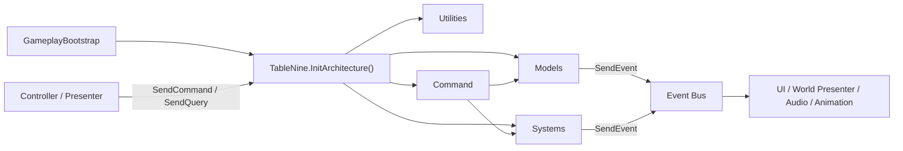
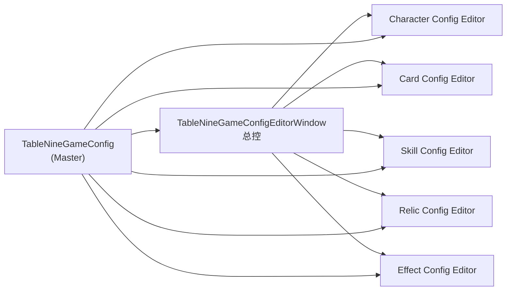

# agents.md

## 项目背景

本项目是一个 `Unity 2022.3 LTS` Built-in 管线开发的 2D 卡牌像素风 Roguelike 游戏，名为 **TableNine**。核心玩法为九宫格棋盘驱动的卡牌战斗。
当前游戏已经完成主干游戏逻辑代码基础，正在迅速落地表现层+交互层以产出初版demo，以及跟随策划的其他临时性改动诉求进行改动。因此有开发时：灵活性 > 规范性。

## 技术框架

- 项目框架采用 `QFramework`。
- 项目本地代码入口在：`Assets/Scripts`，QFramework 框架代码入口在：`Assets/QFramework`。
- ScriptableObject 资产目录：`Assets/ScriptableObjects/`（详见上方「游戏配置（SO）」）
- QFramework Architecture 唯一注册入口：`Assets/Scripts/TableNine.cs`。
- 项目代码组织形式速览：

## 设计文档

- 游戏设计案统一存放在 `Assets/Docs` 目录下。在进行需求理解、功能实现、数据结构设计或 UI 调整前，请优先查阅该目录中的设计资料。
- 游戏开发过程性笔记：`Assets/Notes`，根据自己需求选择性阅读。如果开发过程中用户要求落地笔记、汇报等需求，统一落地在此目录。
- QFramework 用户手册：`Assets/Notes/QframeworkNotes/QFramework_Docs_用户手册.md`（体量较大，按目录查找）。
- QFramework API 文档：`Assets/Notes/QframeworkNotes/QFramework_Docs_API.md`。

## 项目规则

- 开发本项目前，请优先阅读 `rules.md`，其中包含架构规范、渲染配置约定及文件保护规则等全局性约束。
- 当前处于原型开发期，唯一游戏场景：`Assets/Scenes/TableNineBootstrap.unity`
- 项目有 Unity MCP，在落地实现时注意了解功能并辅助使用，如果发现无法使用再回退文件操作形式开发。
- 请在完成代码落地后主动触发unity mcp 的unity 刷新功能并阅读Console，这可以暴露编译代码的错误并帮助你进行修复。
- 项目已经初始化 codegraph，在有代码查询需求、架构了解需求的情况下强烈建议利用 codegraph MCP 进行了解、查找。

## 协作约定

- 以 `Assets/Docs` 中的游戏设计案为准，避免脱离现有设定自行扩展。如用户要求与设计案冲突，应停下并询问。
- 修改或新增功能时，优先复用项目内已有的框架、模块和资源组织方式。但是如果用户的诉求明确有破坏性、侵入性，则以在基础框架编程规范下实现用户需求为第一要务。
- 如果执行过程中发现领域层代码缺少必要事件、ActionKit 动作、状态变更或队列触发点，AI 应回到既有架构内补齐，不得绕过架构直接在表现层硬写逻辑。
- **游戏配置（SO）**：静态数据与效果定义已 ScriptableObject 化，由 Master 汇总 5 个子库，运行时经 `GameplayBootstrap` → `TableNine.ConfigureGameConfig()` 注入 `ConfigModel`；`EffectSystem` / `SkillSystem` / `SkillBehaviorExecutor` 均读 SO，不再依赖运行时 Factory。
- **ScriptableObject 资产目录**：`Assets/ScriptableObjects/`（Master 在根目录；五个子库在 `GameConfig/`）
- 测试注入：`TableNineTestConfig.EnsureProductionConfigLoaded()`（EditMode 自动 resolver）

### 游戏配置编辑器

| 层级 | 资产 / 入口 | 说明 |
|------|-------------|------|
| Master | `Assets/ScriptableObjects/TableNineGameConfig.asset` | 汇总 5 个子库 Object 引用；运行时 bundle 的唯一组装入口 |
| 总控窗口 | 菜单 `TableNine/Game Config/Edit Master Config` | `TableNineGameConfigEditorWindow`：统一入口、侧栏路由、引用回退 |
| 子库 | `GameConfig/TableNine{Character,Card,Skill,Relic,Effect}Config.asset` | 各 `TableNine*ConfigEditorWindow` 专项编辑列表数据 |
| 同步 / 校验 | 菜单 `Sync From Code Defaults` / `Validate` | 实现于 `TableNineGameConfigSync` |

**路由关系：**

## 已知坑点

如果你在项目里发现新的高风险坑点、反复发生的错误或容易误导后续 agent 的事实，追加到此段落后续：

